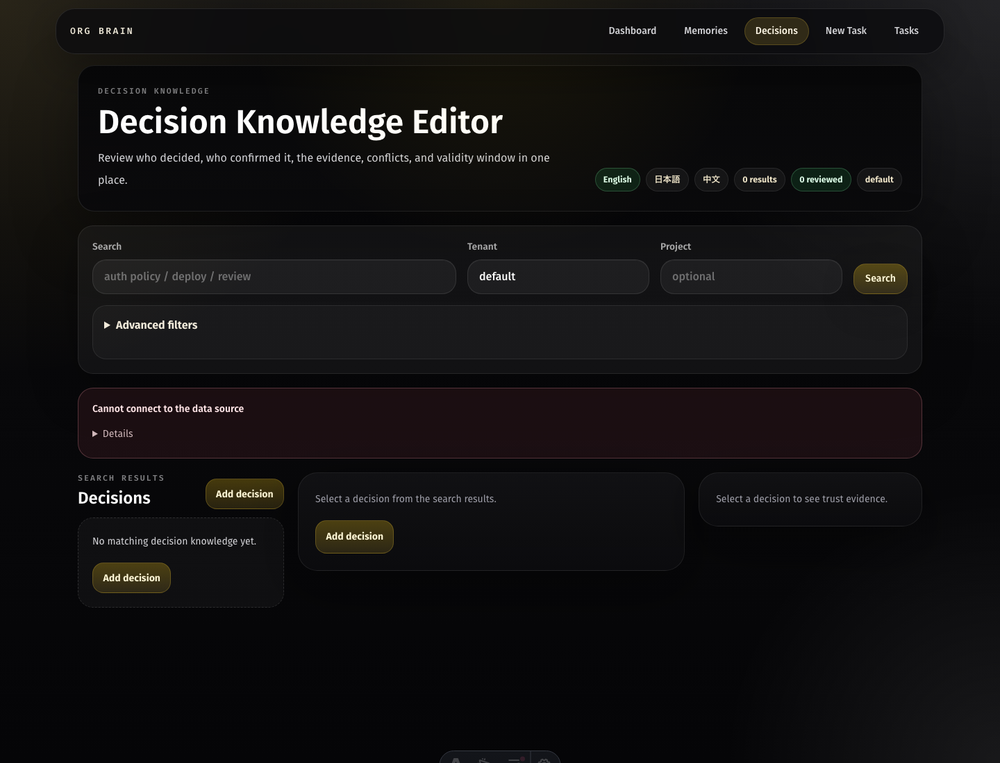
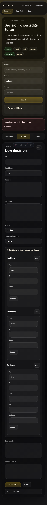

# Org Brain

Org Brain is long-term memory for AI agents: a local-first memory layer that can grow from one developer's machine into a self-hosted team memory bus.

Agents are already good at single tasks. Org Brain is for everything between tasks: the decisions you made last week, the project quirks you do not want to re-explain, the teammate handoffs that should survive a context window, and the organizational knowledge that should become easier to reuse every time an agent touches it.

The future we are building is simple: every person and team should be able to own an AI memory graph that is portable, inspectable, and useful across tools. Start with a private SQLite database on your laptop. When the memory becomes team infrastructure, run the Cloudflare stack yourself. If you want the operations handled for you, use the managed SaaS.

## Why It Matters

- **Local-first memory**: keep personal agent memory in a local SQLite database with no cloud dependency.
- **Agent memory bridge**: connect Codex, Claude Code, Cursor, OpenClaw, OpenCode, and other agent workflows through reusable memory exports and hooks.
- **Team memory bus**: share durable project and organizational context through Cloudflare Workers, D1, R2, Queues, Durable Objects, Remote MCP, and an Astro console.
- **Self-hostable by default**: all source needed to run the OSS stack yourself is public under AGPL-3.0-or-later.
- **Managed SaaS option**: the official hosted service is paid because it includes operations, authentication, monitoring, backups, team administration, and support.

## Benchmark Snapshot

Org Brain's reproducible LongMemEval-S run is intentionally reported as an evidence-backed benchmark, not a vague claim. Public anchors are not same-harness measurements, but they provide useful context.

| System / Track | Accuracy | Evidence recall@5 | Token reduction |
| --- | ---: | ---: | ---: |
| Org Brain reproducible run | 99.4% | 100.0% | 99.54% |
| Zep public answer-accuracy anchor | 90.2% | n/a | n/a |
| gbrain public retrieval anchor | n/a | 97.6% | n/a |
| agentmemory public retrieval anchor | n/a | 95.2% | 99.13% |

Method: LongMemEval-S 500 questions, Gemini judge enabled, single final answer per item, no best-of-N picking, compact evidence-card context, local token estimator for prompt accounting. The benchmark command and comparison report live in `scripts/memory-token-benchmark.mjs`.

## Console Preview

The decision knowledge editor defaults to English and supports Japanese and Chinese through the in-page language switcher or `?lang=ja` / `?lang=zh`.



Mobile create flow:

<p align="center">
  
</p>

## Quick Start: Local SQLite Memory

Use this when you want free personal memory without Cloudflare.

```bash
pnpm install
pnpm local:memory init
printf '{"summary":"Use UTC for backend validation","content":"In astronomy backend tests, run Maven with TZ=UTC to avoid timezone-sensitive failures.","project_id":"astronomy","tags":["testing","memory"]}' | pnpm local:memory upsert
pnpm local:memory search "timezone validation"
pnpm local:memory export-markdown
```

By default the database is stored at `~/.org-brain/memory.sqlite`. Override it with:

```bash
export ORGBRAIN_LOCAL_DB="$HOME/.org-brain/memory.sqlite"
```

After enabling Cloudflare-backed memory in one of the modes below, you can import/export existing local agent memory through the API bridge:

```bash
pnpm sync:agents-memory
```

OpenClaw currently has an import path from `~/.openclaw/memory/main.sqlite`; other agents receive markdown exports.

## Memory Sharing Modes

Cloudflare-backed memory and organization sharing are both OFF by default. With the default env values, `pnpm local:memory` stores personal memory locally and `pnpm hook:bridge` / `pnpm sync:agents-memory` do not write to the Cloudflare API.

```bash
ORGBRAIN_ENABLE_CLOUD_MEMORY=false
ORGBRAIN_ENABLE_ORG_SHARING=false
```

To use personal portable memory on your own Cloudflare deployment, enable Cloudflare memory but keep organization sharing OFF:

```bash
export ORGBRAIN_ENABLE_CLOUD_MEMORY=true
export ORGBRAIN_ENABLE_ORG_SHARING=false
export ORGBRAIN_API_URL="http://127.0.0.1:8787"
export ORGBRAIN_API_KEY="dev-org-brain-api-key"
export ORGBRAIN_TENANT_ID="personal"

pnpm hook:bridge -- codex '{"type":"agent-turn-complete","cwd":"<repo-root>","last-assistant-message":"..."}'
pnpm sync:agents-memory
```

In this mode hook output includes `memory_scope:"personal_cloud"` and `shared_write:false`.

To share memory with an organization, enable both settings and use a team tenant:

```bash
export ORGBRAIN_ENABLE_CLOUD_MEMORY=true
export ORGBRAIN_ENABLE_ORG_SHARING=true
export ORGBRAIN_API_URL="https://<your-worker>.<account>.workers.dev"
export ORGBRAIN_API_KEY="<team-api-key>"
export ORGBRAIN_TENANT_ID="<team-tenant>"
```

For organization sharing, configure tenant grants in the gateway with `API_TENANT_POLICY_JSON` and, for MCP clients, `MCP_TENANT_POLICY_JSON`. In this mode hook output includes `memory_scope:"organization"` and `shared_write:true`, and `pnpm sync:agents-memory` prints a `[mode]` line with the active scope, sharing flag, and tenant before import/export.

## Quick Start: Cloudflare Self-host

Use this when you want team memory sharing, Remote MCP, the console, and the organization bus.

1. Install dependencies:

   ```bash
   pnpm install
   ```

2. Copy local env examples:

   ```bash
   cp .env.example .env
   cp apps/api-gateway/.dev.vars.example apps/api-gateway/.dev.vars
   cp apps/console/.dev.vars.example apps/console/.dev.vars
   ```

3. Configure Cloudflare resources in each `wrangler.toml`: D1, R2, Queues, Durable Objects, and service bindings.

4. Apply D1 migrations:

   ```bash
   pnpm -C apps/api-gateway wrangler d1 migrations apply open-brain --local -c wrangler.local.toml
   ```

5. Run the local gateway and console in two terminals:

   ```bash
   pnpm -C apps/api-gateway wrangler dev --port 8787 -c wrangler.local.toml
   pnpm -C apps/console dev
   ```

6. For production self-hosting, deploy in dependency order:

   ```bash
   pnpm -C apps/cap-runner build
   pnpm -C apps/org-router build
   pnpm -C apps/api-gateway build
   pnpm -C apps/mcp build
   pnpm -C apps/console build
   ```

## What Is Included

- `scripts/local-memory.mjs`: personal SQLite memory CLI.
- `scripts/hook-memory-bridge.mjs`: reusable-memory capture from local agent hooks.
- `scripts/sync-agents-memory.mjs`: import/export bridge for local agent memory.
- `apps/api-gateway`: Hono API Worker for memory, docs, tasks, measurement, and Remote MCP.
- `apps/org-router`: queue router for the organization bus.
- `apps/cap-runner`: capability workers, maintenance jobs, and Durable Objects.
- `apps/mcp`: compatibility Remote MCP Worker.
- `apps/console`: Astro console for browsing and operating memory.
- `packages/shared`: shared schemas, retrieval helpers, lifecycle types, and knowledge-doc utilities.
- `migrations`: D1 SQL migrations for the self-hosted Cloudflare stack.

## Memory APIs

The self-hosted API gateway exposes:

- `POST /v1/memories/search`
- `POST /v1/memories/profile`
- `POST /v1/memories/capture`
- `POST /v1/memories/propose`
- `POST /v1/memories/confirm`
- `POST /v1/memories/revise`
- `POST /v1/memories/refresh`
- `POST /v1/memories/suppress`
- `POST /v1/decision-memories/search`
- `GET /v1/decision-memories/:id/context`
- `POST /v1/decision-memories/:id/revise`
- `POST /v1/decision-memories/:id/confirm`
- `/mcp` for Remote MCP clients

Memory search supports lexical query expansion, hybrid memory/docs retrieval, recent history, lifecycle states, and rationale-aware filters.
Decision memory APIs support opt-in provenance and trust review for the Console decision editor without changing default memory retrieval profiles.

## Benchmark Commands

Token-only smoke:

```bash
pnpm benchmark:tokens -- \
  --leaderboard-profile org_brain_repro \
  --dataset-path /tmp/org-brain-longmemeval-s.json \
  --limit 500 \
  --skip-llm \
  --compare-public
```

Full LLM-judged run:

```bash
pnpm benchmark:tokens -- \
  --leaderboard-profile org_brain_repro \
  --retrieval-profile longmemeval_session \
  --answerer-profile worksheet_router \
  --dataset-path /tmp/org-brain-longmemeval-s.json \
  --limit 500 \
  --token-budget 650 \
  --context-char-limit 900 \
  --estimate-tokens \
  --compare-public \
  --write-results-jsonl /tmp/org-brain-longmemeval-results.jsonl
```

Set `GEMINI_API_KEY` or `GOOGLE_API_KEY` before running LLM judging.

## Managed SaaS

Self-hosting is free under AGPL-3.0-or-later. The official managed SaaS is paid because it provides:

- hosted Cloudflare deployment and upgrades
- authentication and team administration
- monitoring, backups, and operational support
- managed Remote MCP endpoints
- reliability work that most teams do not want to own

The public repo does not include official SaaS billing systems, customer administration, production secrets, or official domain configuration.

## License

Org Brain is licensed under AGPL-3.0-or-later. If you modify the software and provide it over a network, the AGPL requires you to provide the corresponding source code for that modified version.

The Org Brain name, official hosted service, official domains, billing operations, and managed service branding are not granted by the source license.

## Project Status

Initial public release target: `0.1.0`. Product versioning is tracked with SemVer in `CHANGELOG.md` and GitHub Releases. Feature-level labels such as internal prototype versions are not part of the public release story.
