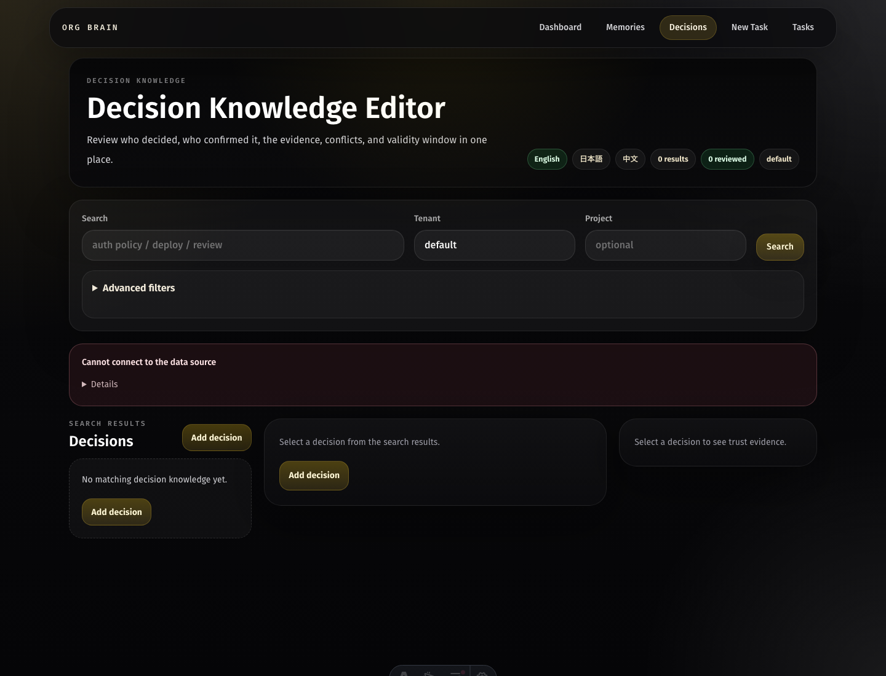

# OrgBrain

**AIが動くたび、組織が学ぶ。**

**Every time AI agents work, the organization learns.**

OrgBrain is the organizational memory layer for AI agents.

It turns every agent action, decision, handoff, and failure into reusable context,
so the next agent does not start from zero.

AI agents are already good at individual tasks.

OrgBrain is for what happens between tasks: why a decision was made, what failed last time,
which teams are working on related problems, and how today's work affects tomorrow's plan.

The future we are building is simple:

**every organization should have a memory that AI agents can read, update, and use to move work forward.**

OrgBrain includes reproducible memory retrieval benchmarks. See [Benchmarks](#benchmarks) for details.

Human identity and tenant administration are documented in
[`docs/IDENTITY_ADMINISTRATION.md`](docs/IDENTITY_ADMINISTRATION.md). OSS supports
display/full names, organizations, users, local groups, business categories,
email OTP, and OIDC JIT while preserving existing principals and API identities.

## What is OrgBrain?

OrgBrain is local-first, self-hostable infrastructure for shared AI-agent memory.

Start with a private SQLite database on your laptop. When memory becomes team infrastructure,
run the Cloudflare stack yourself. If you want the operations handled for you, use the managed SaaS.

The product goal is bigger than long-term memory for one agent. OrgBrain is designed to help teams
turn agent work into organizational learning: decisions, lessons, warnings, project facts,
handoffs, and dependency context that can be reused across tools and over time.

## The Problem

AI agents are powerful, but they still behave like new hires every morning.

They usually do not know:

- what was decided yesterday
- why a plan changed
- what failed in another team
- which project depends on this one
- whether another agent is solving the same problem
- what organizational context should shape the next action

This makes agent workflows fragile. Context disappears between runs, teams repeat mistakes,
and useful knowledge remains scattered across chats, docs, tickets, pull requests, and human memory.

## The Future

With OrgBrain, every agent run can make the organization smarter.

- Yesterday's decisions become today's context.
- One team's failure becomes another agent's warning.
- Related projects and dependencies are connected automatically.
- Agents across tools can share the same organizational memory.
- The organization learns as AI agents work.

OrgBrain is built for a future where agents do not just execute tasks.
They help the organization remember, connect, and improve.

## What OrgBrain Does

OrgBrain gives AI agents a shared memory loop:

1. **Capture**

   Record useful context from agent runs, human decisions, project updates, and handoffs.

2. **Distill**

   Convert raw activity into reusable memories: decisions, lessons, warnings, project facts, and dependencies.

3. **Connect**

   Link related projects, teams, failures, documents, and agent work across the organization.

4. **Recall**

   Retrieve the right memory before the next agent acts.

5. **Improve**

   Every agent run makes the organization easier for future agents to understand.

## Example Use Cases

### Morning project briefing

Ask an agent what changed overnight.

OrgBrain helps it answer:

- what decisions were made yesterday
- why they were made
- which tasks are now blocked
- what needs attention today

### Cross-team collaboration

When two teams or agents are solving related problems,
OrgBrain can surface the overlap and make collaboration easier to notice before work is duplicated.

### Project planning with dependencies

When an agent creates a plan,
OrgBrain can bring in related projects, timelines, constraints, and critical paths
so the plan reflects the broader organization, not just the current task.

### Failure-aware execution

When an agent is about to repeat a risky pattern,
OrgBrain can recall previous failures and surface warnings, checklists, or review requirements.

## Why It Matters

Most AI agents forget the organization around them.

They do not know:

- what was decided yesterday
- why a plan changed
- what failed in another team
- which project depends on this one
- when two agents are solving the same problem

OrgBrain gives agents shared organizational memory.

That means:

- fewer repeated mistakes
- better handoffs between agents and humans
- project context that survives context windows
- reusable lessons across teams
- AI workflows that get smarter over time

## Why OrgBrain is Different

OrgBrain is not just a vector database or a personal memory plugin.

It is designed around organizational memory:

- **Local-first**: start with memory you can inspect and own.
- **Agent-agnostic**: work across different AI tools and harnesses.
- **Decision-aware**: preserve not just what happened, but why it happened.
- **Failure-aware**: turn mistakes into reusable warnings and checklists.
- **Team-ready**: move from local memory to a shared memory bus when teams need it.
- **Portable**: keep memory exportable and compatible with Markdown/Git-style workflows.

The goal is not only to help one agent remember.
The goal is to help the organization learn.

## Choose Your Mode

| Mode | Best for | Storage | Sharing |
| --- | --- | --- | --- |
| Local | personal or project-level agent memory | SQLite | private |
| Self-hosted | team memory bus | Cloudflare stack | tenant-scoped |
| Managed | teams that do not want to operate infrastructure | hosted OrgBrain | managed |

SQLite is the dependency-free local default and D1 is the shared Cloudflare
default. A PostgreSQL + pgvector backend is planned as a future opt-in for
deployments with measured scale, concurrency, transaction, analytics, or
private-network requirements. It will use one authoritative store at a time;
OrgBrain will not dual-write source-of-truth memory across databases. See
[`docs/STORAGE_BACKENDS.md`](docs/STORAGE_BACKENDS.md) for the activation and
parity gates.

## Quick Start: Local Memory

Use this when you want free personal memory without Cloudflare.

Requires Node.js 22.13 or newer. The CLI uses the SQLite driver bundled with Node;
the external `sqlite3` command is not required.

```bash
pnpm install
pnpm exec orgbrain init
pnpm exec orgbrain doctor
printf '{"summary":"Use UTC for backend validation","content":"In astronomy backend tests, run Maven with TZ=UTC to avoid timezone-sensitive failures.","project_id":"astronomy","kind":"constraint","tags":["testing","memory"]}' | pnpm exec orgbrain memory capture
pnpm exec orgbrain memory search "timezone validation"
pnpm exec orgbrain memory export --format markdown
```

By default the database is stored at `~/.org-brain/memory.sqlite`. Override it with:

```bash
export ORGBRAIN_LOCAL_DB="$HOME/.org-brain/memory.sqlite"
```

The local database uses WAL, schema migrations, content hashes, immutable version
snapshots, and private filesystem modes (`0700` directory, `0600` database and
backups). Operational commands:

```bash
pnpm exec orgbrain index rebuild
pnpm exec orgbrain backup create
pnpm exec orgbrain backup verify --from ~/.org-brain/backups/<backup>.sqlite
pnpm exec orgbrain backup restore --from ~/.org-brain/backups/<backup>.sqlite
pnpm exec orgbrain migrate --from /path/to/legacy-memory.sqlite
pnpm exec orgbrain serve
pnpm exec orgbrain mcp
pnpm exec orgbrain profile set --display-name "Miya" --full-name "Miyajima Kazuhiro"
pnpm exec orgbrain organization set --slug example --display-name "Example Inc."
pnpm exec orgbrain user list
pnpm exec orgbrain group list
pnpm exec orgbrain category list --include-inactive
```

`orgbrain serve` binds to `127.0.0.1` by default and local mode makes no external
network requests. `orgbrain mcp` is a stdio MCP server over the same SQLite
MemoryStore, so Codex, Claude, and OpenCode can use local capture and search
without a second daemon or cloud account. See [Local migration and recovery](docs/LOCAL_MIGRATION.md) and
the [threat model](docs/THREAT_MODEL.md).

Generate a reviewable MCP registration plan for any supported agent, then add
`--execute` only when you want the CLI to change that agent's configuration:

```bash
orgbrain connector setup codex
orgbrain connector setup claude --scope user
orgbrain connector setup opencode --scope project
orgbrain connector setup openclaw

orgbrain connector setup codex --execute
```

Codex, Claude Code, and OpenCode use their documented MCP CLI registration
commands. OpenClaw returns the exact `mcp.servers` JSON to merge and its config
validation command because its configuration is managed as a bundle/config
surface. References: [Codex MCP](https://developers.openai.com/codex/mcp/),
[Claude Code MCP](https://docs.anthropic.com/en/docs/claude-code/mcp),
[OpenCode MCP](https://opencode.ai/v2/docs/mcp-servers), and
[OpenClaw MCP](https://docs.openclaw.ai/cli/mcp).

For shared Remote MCP, interactive Codex, Claude Code, and Cursor connections
use Cloudflare Access Managed OAuth through the Access-protected MCP URL:

```bash
orgbrain connector setup codex --mode remote-mcp --url https://mcp.example.com/mcp
orgbrain connector setup claude --mode remote-mcp --url https://mcp.example.com/mcp --scope user
orgbrain connector setup cursor --mode remote-mcp --url https://mcp.example.com/mcp --scope user

# Repeat the reviewed command with --execute to modify client settings.
```

Automatic realtime hooks use a different credential per machine and client.
Create a pending installation in Console, create a dedicated Access Service
Token, review the dry run below, then add `--execute`. Secrets are read from a
masked TTY prompt or setup-only environment variables and stored at
`~/.config/org-brain/clients/<installation-id>/credentials.env` with mode
`0600`:

```bash
orgbrain connector setup codex --mode cloud-hooks \
  --url https://mcp.example.com/mcp --workspace "$PWD"
```

The cloud hook calls no LLM and reads no full transcript. It sends only memory
and rationale that passed the existing deterministic promote/skip classifier.
Failures are non-blocking and retry from an installation-specific private
outbox in batches of at most 100. Flushes atomically claim rows so concurrent
hook events cannot overwrite them. Authentication-failed rows are not sent to
the capture tool until a metadata-only status check revalidates the same
installation ID. When a hook explicitly names its installation credential file,
those URL, service-token, installation, tenant, and outbox values override any
stale inherited Org Brain authentication variables; every hook process verifies
the installation ID through the status endpoint before its first capture.

For the smallest Codex installation, use local lifecycle hooks instead of MCP.
The command is a reviewable dry run unless `--execute` is supplied:

```bash
# From a checkout; creates the reusable `orgbrain` command.
npm install --global .

orgbrain connector setup codex --mode minimal-hooks \
  --workspace "$PWD" \
  --project-id "$(basename "$PWD")"

orgbrain connector setup codex --mode minimal-hooks \
  --workspace "$PWD" \
  --project-id "$(basename "$PWD")" \
  --maintenance daily \
  --execute
```

This mode installs two bounded command hooks and no resident process:

- `UserPromptSubmit` searches local SQLite and adds at most two short, redacted
  historical summaries as untrusted reference context.
- `Stop` stores only reusable, high-signal conclusions through the existing
  deterministic quality filter.

The installer makes no LLM calls and does not register an MCP server. It safely
merges `~/.config/org-brain/hooks.env`,
`~/.config/org-brain/workspaces.json`, and `~/.codex/hooks.json`, initializes
`~/.org-brain/memory.sqlite`, preserves unrelated hooks, creates timestamped
backups, and is idempotent. Existing cloud-enabled settings fail closed unless
`--force` is explicitly supplied. Restart Codex after installation, open
`/hooks`, and trust the OrgBrain `UserPromptSubmit` and `Stop` commands once.
See the official [Codex hooks documentation](https://learn.chatgpt.com/docs/hooks)
for the lifecycle event and trust model.

On macOS, `--maintenance daily` also installs the user-owned LaunchAgent
`com.orgbrain.personal-maintenance`. It runs at 03:17 local time and invokes the
same packaged CLI against local SQLite. The job makes no LLM calls or cloud
writes. It creates deterministic canonical summaries and digests, suppresses
old automatic-hook duplicates without deleting them, repairs indexes only when
verification fails, and never automatically compacts manually captured rows.
Plain `npm install` does not register the job; it is installed only by the
explicit `--maintenance daily --execute` option.

```bash
# Preview or apply the same maintenance manually.
orgbrain maintenance run
orgbrain maintenance run --apply

# Inspect the LaunchAgent and last run, or remove it recoverably.
orgbrain maintenance status
orgbrain maintenance uninstall --execute
```

The LaunchAgent lives at
`~/Library/LaunchAgents/com.orgbrain.personal-maintenance.plist`. Last-run state
and bounded stdout/stderr logs live under `~/.config/org-brain/`. Installation
is idempotent; replacement and uninstall preserve the previous plist under
`~/.config/org-brain/backups/`. Linux and Windows schedulers are not installed
by this personal macOS mode.

The common hook bridge accepts Codex, Claude, OpenCode, and OpenClaw events.
When cloud memory is disabled (the default), distilled durable entries are
written directly to local SQLite; raw transcripts are not stored:

```bash
printf '%s' '{"type":"agent-turn-complete","project_id":"my-project","memory_entry":{"type":"project-fact","trigger":"A release is planned","decision":"Require approval before production","reason":"Keep releases auditable","evidence":"ADR-42","action":"Run the approval gate","result":"Policy confirmed","reuse":"Apply before every release","validity":"Until ADR-42 is superseded","tags":"policy,release"}}' \
  | pnpm exec orgbrain event ingest codex
```

Use `claude`, `opencode`, or `openclaw` in place of `codex`; the bridge
normalizes each native event envelope to the same durable-memory contract.
Set `ORGBRAIN_LOCAL_HOOK_CAPTURE=false` to disable this local automatic capture.

After enabling Cloudflare-backed memory in one of the modes below, you can import/export existing local agent memory through the API bridge:

```bash
pnpm sync:agents-memory
```

OpenClaw currently has an import path from `~/.openclaw/memory/main.sqlite`; other agents receive markdown exports.

### Supported local runtime

| Component | Supported |
| --- | --- |
| Node.js | 22.13 or newer |
| macOS | Current supported releases, arm64 and x64 |
| Linux | glibc-based arm64 and x64 distributions |
| Windows | Native Node CLI; private-mode checks follow platform capabilities |
| Storage | SQLite bundled with Node, no external database required |

Docker Compose exposes the container only on host loopback and persists data in
a named volume:

```bash
docker compose up --build
curl http://127.0.0.1:8788/health
```

Release assets also include `orgbrain.mjs`, a single-file executable bundle for
users who already have Node.js 22.13 or newer and do not want to install the npm
package:

```bash
chmod +x orgbrain.mjs
./orgbrain.mjs init
./orgbrain.mjs memory search "release policy"
```

`pnpm build:standalone` reproduces the bundle locally. Tagged releases publish
its SHA-256 checksum and include the bundle in the build-provenance attestation.

## Quick Start: Self-hosted Team Memory

Use this when you want team memory sharing, Remote MCP, the console, and the organization bus.

For a local copy of the current production data used by memory evaluation and
console development, see [`docs/LOCAL_PRODUCTION_SNAPSHOT.md`](docs/LOCAL_PRODUCTION_SNAPSHOT.md).

1. Install dependencies:

   ```bash
   pnpm install
   ```

2. Copy local env examples:

   ```bash
   cp .env.example .env
   cp apps/api-gateway/.dev.vars.example apps/api-gateway/.dev.vars
   cp apps/console/.dev.vars.example apps/console/.dev.vars
   ```

3. Configure Cloudflare resources in each `wrangler.toml`: D1, R2, Queues, Durable Objects, and service bindings.

   The CLI can inspect the checkout and produce the complete provisioning plan
   without changing Cloudflare or local configuration:

   ```bash
   pnpm exec orgbrain cloud doctor --root .
   pnpm exec orgbrain cloud provision --root . --with-vectorize
   ```

   After reviewing that JSON plan, provide a narrowly scoped Cloudflare token
   and opt in to execution:

   ```bash
   export CLOUDFLARE_ACCOUNT_ID="<account-id>"
   export CLOUDFLARE_API_TOKEN="<provisioning-token>"
   pnpm exec orgbrain cloud provision --root . --with-vectorize --execute
   ```

Execution creates missing D1, R2, Queue/DLQ, and optional Vectorize
   resources, synchronizes the resulting D1 UUID across the three Worker
   configurations, applies remote migrations, and deploys services in
   dependency order. It does not create application API keys, OIDC policy, or
   production secrets. Run `cloud doctor --live` to verify Cloudflare
authentication separately.

`.github/workflows/cloud-restore-drill.yml` provides the staging recovery gate.
With the `cloud-staging` environment configured with
`CLOUDFLARE_ACCOUNT_ID`, `CLOUDFLARE_API_TOKEN`, and optionally
`ORGBRAIN_STAGING_D1_NAME`, plus `OPS_ALERT_WEBHOOK_URL` for failure alerts, it
resolves the D1 UUID, exports the staging database, restores into an
isolated run-specific database, verifies counts and ordered content hashes,
checks RPO ≤ 5 minutes and RTO ≤ 60 minutes, then deletes the drill database in
an `always()` cleanup step. Until that workflow has a successful staging
artifact, the targets are configured but not production evidence.

4. If you did not use `cloud provision --execute`, apply D1 migrations manually:

   ```bash
   pnpm -C apps/api-gateway wrangler d1 migrations apply open-brain --local -c wrangler.local.toml
   ```

5. Run the local gateway and console in two terminals:

   ```bash
   pnpm -C apps/api-gateway wrangler dev --port 8787 -c wrangler.local.toml
   pnpm -C apps/console dev
   ```

6. For production self-hosting, deploy in dependency order:

   ```bash
   pnpm -C apps/cap-runner build
   pnpm -C apps/org-router build
   pnpm -C apps/api-gateway build
   pnpm -C apps/console build
   ```

   `apps/mcp` is a compatibility Worker for deployments that still require the
   old service-binding proxy. New deployments use the API Gateway `/mcp`
   endpoint and do not need to deploy it.

## Agent Integrations

OrgBrain is agent-agnostic by design. It can connect Codex, Claude Code, Cursor, OpenClaw,
OpenCode, and other agent workflows through reusable memory exports and hooks.

Cloudflare-backed memory and organization sharing are both OFF by default. With the default env values,
`pnpm local:memory` stores personal memory locally and `pnpm hook:bridge` / `pnpm sync:agents-memory`
do not write to the Cloudflare API.

```bash
ORGBRAIN_ENABLE_CLOUD_MEMORY=false
ORGBRAIN_ENABLE_ORG_SHARING=false
```

Hook processes load `~/.config/org-brain/hooks.env` first. Keep only connection, authentication,
and global fallback values there; workspace routing belongs in `workspaces.json`:

```dotenv
ORGBRAIN_ENABLE_CLOUD_MEMORY=true
ORGBRAIN_ENABLE_ORG_SHARING=true
ORGBRAIN_MCP_URL=https://<your-worker>.<account>.workers.dev/mcp
ORGBRAIN_MCP_CLIENT_ID=<cloudflare-access-service-token-id>
ORGBRAIN_MCP_CLIENT_SECRET=<cloudflare-access-service-token-secret>
ORGBRAIN_TENANT_ID=default
```

Cloud hooks use MCP `2026-07-28` directly through the known
`orgbrain_memories_capture_rationale` tool. The bridge performs no discovery
and no LLM call. `ORGBRAIN_API_URL` / `ORGBRAIN_API_KEY` remain a legacy REST
fallback only when no `ORGBRAIN_MCP_*` setting is present.

`ORGBRAIN_TENANT_ID` is optional when every workspace has an explicit tenant mapping. It remains the
convenient fallback for a current single-tenant installation. Do not put repository names or paths in
`hooks.env`.

The first reusable (non-low-signal) hook event for a workspace creates
`~/.config/org-brain/workspaces.json`. The directory is written with mode `0700`, the file with mode
`0600`, and replacement is atomic and lock-serialized so concurrent first-use hooks do not lose mappings.
Interactive project confirmation happens outside that lock, so one unanswered prompt does not block other
hook events. Generic completion events that are skipped do not create it.

```json
{
  "version": 1,
  "workspaces": {
    "/absolute/path/to/org-brain": {
      "tenant_id": "team-platform",
      "project_id": "org-brain"
    }
  }
}
```

For local-only use without `ORGBRAIN_TENANT_ID`, the file keeps `tenant_id: null` while runtime storage
continues to use the local `default` scope. This deliberately avoids pinning an implicit tenant. When an
explicit tenant is later supplied, the next reusable hook assigns it; organization sharing without that
assignment still fails closed.

Resolution is workspace mapping first, then `ORGBRAIN_TENANT_ID` as the tenant fallback. An explicit
`project_id` in a hook payload applies only to that event; otherwise the mapped project is used. A new
workspace defaults its project to `basename(cwd)` and can confirm it interactively. When organization
sharing is enabled, a missing workspace tenant and missing `ORGBRAIN_TENANT_ID` stop ingestion instead
of writing to `default` or another tenant. The API still enforces tenant grants server-side; the local
file selects routing but does not grant access.

Older `~/.config/org-brain/project-names.json` entries are imported on the first eligible hook event
using the resolved tenant. The old file is kept unchanged for rollback. `ORGBRAIN_WORKSPACES_FILE` and
`ORGBRAIN_PROJECT_NAMES_FILE` can override the two paths. Operator jobs such as memory quality backfill
project current-state snapshots, and usage status derive project roots from the same `workspaces.json`;
`ORGBRAIN_PROJECT_ROOTS` remains an explicit compatibility override.

If `ORGBRAIN_WORKSPACES_FILE` points outside the default dedicated directory, Org Brain keeps the
existing parent directory permissions unchanged and applies `0600` only to the mapping and lock files.

To use personal portable memory on your own Cloudflare deployment, enable Cloudflare memory but keep organization sharing OFF:

```bash
export ORGBRAIN_ENABLE_CLOUD_MEMORY=true
export ORGBRAIN_ENABLE_ORG_SHARING=false
export ORGBRAIN_API_URL="http://127.0.0.1:8787"
export ORGBRAIN_API_KEY="dev-org-brain-api-key"
export ORGBRAIN_TENANT_ID="personal"

pnpm hook:bridge -- codex '{"type":"agent-turn-complete","cwd":"<repo-root>","last-assistant-message":"..."}'
pnpm sync:agents-memory
```

In this mode hook output includes `memory_scope:"personal_cloud"` and `shared_write:false`.

To share memory with an organization, enable both settings and use a team tenant:

```bash
export ORGBRAIN_ENABLE_CLOUD_MEMORY=true
export ORGBRAIN_ENABLE_ORG_SHARING=true
export ORGBRAIN_API_URL="https://<your-worker>.<account>.workers.dev"
export ORGBRAIN_API_KEY="<team-api-key>"
export ORGBRAIN_TENANT_ID="<team-tenant>"
```

For organization sharing, configure tenant grants in the gateway with `API_TENANT_POLICY_JSON` and,
for MCP clients, `MCP_TENANT_POLICY_JSON`. In this mode hook output includes
`memory_scope:"organization"` and `shared_write:true`, and `pnpm sync:agents-memory` prints a `[mode]`
line with the active scope, sharing flag, and tenant before import/export.

Agent messages provide an agmsg-style inbox over the same API credentials:

```bash
pnpm agmsg send --to agent:codex --subject "Review needed" --body "Please check the latest plan."
pnpm agmsg inbox --target agent:codex
pnpm agmsg ack <message-id> --target agent:codex
```

The CLI uses `ORGBRAIN_API_URL`, `ORGBRAIN_API_KEY`, and `ORGBRAIN_TENANT_ID`.
`ORGBRAIN_API_BASE` remains a compatibility alias when `ORGBRAIN_API_URL` is unset.

Identity is explicit. API-key requests are owned by the `principal` configured for that key, such as
`user:alice@example.com`, `team:platform`, or `service:openclaw-orgbrain`. Cloudflare Access login requests
resolve through `user_identities` to the existing Org Brain user principal; hook runtime identity remains
separate as `client:<installation-id>`. Optional profile fields such as display name, email, company name,
and organization name are for display only; sharing uses tenant-scoped groups and resource ACLs, so groups
can span companies, departments, projects, or any other collaboration unit.

## Memory APIs

The self-hosted API gateway exposes:

- `GET /v1/auth/me`
- `PUT /v1/auth/me/profile`
- `GET|PUT|DELETE /v1/role-assignments`
- `GET|POST|DELETE /v1/scoped-tokens`
- `GET|PUT /v1/retention-policies`
- `POST /v1/retention-policies/apply` (dry-run unless `execute=true`)
- `GET /v1/retention-queue`
- `POST /v1/retention-queue/cancel` (up to 100 queued items)
- `GET /v1/audit-events`
- `GET /v1/audit-events/verify`
- `GET|POST /v1/mcp-client-installations`
- `DELETE /v1/mcp-client-installations/:id`
- `GET /v1/groups`
- `POST /v1/groups`
- `PUT /v1/resource-shares`
- `POST /v1/agent-messages`
- `GET /v1/agent-messages`
- `GET /v1/agent-messages/:messageId`
- `POST /v1/agent-messages/:messageId/read`
- `POST /v1/agent-messages/:messageId/ack`
- `POST /v1/memories/search`
- `POST /v1/memories/profile`
- `POST /v1/memories/capture`
- `POST /v1/memories/propose`
- `POST /v1/memories/confirm`
- `POST /v1/memories/revise`
- `POST /v1/memories/refresh`
- `POST /v1/memories/suppress`
- `DELETE /v1/memories/:memoryId`
- `POST /v1/retrieval-index/rebuild`
- `GET /v1/ops/status`
- `POST /v1/ops/tasks/:id/replay` (failed/dead-letter task replay)
- `POST /v1/decision-memories/search`
- `POST /v1/decision-memories/review-queue`
- `GET /v1/decision-memories/:id/context`
- `POST /v1/decision-memories/:id/revise`
- `POST /v1/decision-memories/:id/confirm`
- `POST /v1/context/pre-action-gate`
- `POST /v1/context/review-check`
- `POST /v1/context/debt/scan`
- `/mcp` for Remote MCP clients

Cloud deployments record every scheduled run in D1. The API Gateway retention
cron runs daily at 04:15 JST. Production is initially deployed with
`RETENTION_SWEEP_MODE=off`; switch it to `observe` only after the initial smoke
tests. `enforce` suppresses at most 500 newly expired memories,
waits seven days, then deletes at most 100 unchanged, non-held memories per
run. Queue cancellation safely restores system-suppressed memories when they
have not changed during the grace period.

The hourly `.github/workflows/ops-watchdog.yml` workflow calls the protected
`POST /internal/ops/watchdog/run` endpoint. Configure `OPS_WATCHDOG_TOKEN` and
`OPS_ALERT_WEBHOOK_URL` as API Gateway secrets and mirror them, together with
`ORGBRAIN_API_URL`, in the GitHub `ops-production` environment. Alerts are sent
for stale scheduled jobs, failed/DLQ or stuck tasks, degraded retrieval
projection, and retention queue failures. Active alerts repeat after six hours
and emit one resolution notification.

Memory search supports lexical query expansion, hybrid memory/docs retrieval, recent history,
lifecycle states, and rationale-aware filters. `search_mode=hybrid_v2` fuses lexical,
semantic, graph, time, authority, and utility signals and returns a score breakdown.
When Workers AI and Vectorize are not bound, semantic scoring is explicitly reported
as unavailable and the response sets `meta.retrieval.degraded=true`; it is never
simulated with lexical overlap.
Decision memory APIs support opt-in provenance and trust review for the Console decision editor
without changing default memory retrieval profiles.

Personal mode uses `local-sparse-feature-hash-v2` by default. It builds a
reconstructable SQLite sparse-vector projection from normalized terms, local
concept aliases, and CJK trigrams; no model download or network request occurs.
Local search fuses FTS, cosine-style sparse-vector similarity, memory edges,
recency, authority, and utility. `orgbrain index rebuild` recreates both FTS and
the local vector projection, while `doctor` and backup verification compare
their row counts with the authoritative records.
`orgbrain serve` also creates a verified startup backup and repeats it every
five minutes by default. Set `ORGBRAIN_AUTO_BACKUP=false` to disable it or
`ORGBRAIN_AUTO_BACKUP_INTERVAL_MS` to change the interval (minimum one minute).

For real semantic search, create a 384-dimensional cosine Vectorize index, add
`AI` and `MEMORY_VECTOR_INDEX` bindings, then call the admin-only
`POST /v1/retrieval-index/rebuild` endpoint. New and revised memories are then
projected automatically, while suppression and deletion remove their vectors.

Cloud deployments accept API keys, Cloudflare Access JWTs, or generic RS256 OIDC
JWTs. Generic OIDC uses `OIDC_ISSUER`, `OIDC_AUD`, optional
`OIDC_JWKS_JSON`, and `OIDC_TENANT_POLICY_JSON`. Admins can issue short-lived
`obp_` scoped tokens; only a SHA-256 token hash is stored and the clear token is
returned once. Retention enforcement is dry-run by default, and matching legal
holds block hard deletion.

Remote MCP uses a separate Access audience (`MCP_ACCESS_AUD`). Interactive
clients resolve to the user's existing principal; service-token hooks resolve
through `mcp_client_installations` and can call only
`orgbrain_memories_capture_rationale`. `MCP_AUTH_MODE` defaults to fail-closed
`access`; use explicit `dual` only during migration from legacy JSON secrets.

Cloud deployments may additionally bind `API_RATE_LIMITER` using a Workers
Rate Limiting binding. Requests are keyed by authenticated tenant, principal,
and route; rejected requests return HTTP 429 and are recorded as denied audit
events. The binding is optional so local/self-hosted development remains
dependency-free:

```toml
[[ratelimits]]
name = "API_RATE_LIMITER"
namespace_id = "1001"

  [ratelimits.simple]
  limit = 1500
  period = 60
```

## Benchmarks

OrgBrain's reproducible LongMemEval-S run is intentionally reported as an evidence-backed benchmark,
not a vague claim. Public anchors are not same-harness measurements, but they provide useful context.

| System / Track | Accuracy | Evidence recall@5 | Token reduction |
| --- | ---: | ---: | ---: |
| OrgBrain LongMemEval-specific profile | 96.8% | 100.0% | 99.54% |
| OrgBrain legacy product search path | n/a | 15.0% | n/a |
| OrgBrain `hybrid_v3` product path, five-repeat minimum | n/a | 99.8% | n/a |
| Supermemory public answer-accuracy anchor | 95.0% | n/a (R@15) | 99.4% |
| Mem0 OSS public answer-accuracy anchor | 91.0% | n/a | n/a |
| Zep public answer-accuracy anchor | 90.2% | n/a | n/a |
| gbrain public retrieval anchor | n/a | 97.6% | n/a |
| agentmemory public retrieval anchor | n/a | 95.2% | 99.13% |

Method for the LongMemEval-specific profile: LongMemEval-S 500 questions,
Gemini 3.6 Flash for answer generation and judging, single final answer per
item, no best-of-N picking, compact evidence-card context, and a local token
estimator for prompt accounting. The benchmark command and comparison report
live in `scripts/memory-token-benchmark.mjs`.

The profile above is not the production `LocalMemoryStore` retrieval path. A
separate 2026-07-30 product-path check captured 23,867 sessions through
`LocalMemoryStore.capture()` and queried them through `LocalMemoryStore.search()`;
it retrieved a gold session in the top five for only 75 of 500 questions
(15.0%, p95 search latency 991.44 ms). The LongMemEval-specific result must
therefore not be used to claim that the current product implementation is
first overall.

An additive `hybrid_v3` product path is now available in shadow mode. It uses
rebuildable retrieval units, D1/SQLite FTS, a separate Qwen3 Vectorize index,
BGE reranking, and optional asynchronous Gemini 3.5 Flash-Lite atomic
projection. Its product-only runner and rollout status are documented in
[`docs/HYBRID_V3_IMPLEMENTATION.md`](docs/HYBRID_V3_IMPLEMENTATION.md). A
2026-07-30 frozen product-path run scored 499/500 (99.8% R@5) in every one of
five repeats, passed every category gate, reported zero errors, and had a
worst-repeat p95 of 278.070 ms. The LongMemEval data was development-exposed,
so its hash-selected 100 partition is not treated as sealed. A separately
unopened LoCoMo 100-question evidence-session holdout scored 92/100 and was not
used for post-result tuning. Cross-benchmark and same-harness competitor gates
still apply.

An additive `hybrid_v4` path now layers generic atomic/profile/state/timeline
projections, bounded segment retrieval, a separate Vectorize namespace, and
the public `MemoryStore.retrieveContext()` evidence-bundle contract over v3.
Its implementation, degradation behavior, sealed-evaluation boundary, and
remaining leadership gates are documented in
[`docs/HYBRID_V4_IMPLEMENTATION.md`](docs/HYBRID_V4_IMPLEMENTATION.md).
No overall-first-place claim is emitted until the audited 200-row payload,
10M performance run, ONNX model selection, and every eligible same-harness
competitor scorecard are complete.

The fixed `competitive-memory-v1` suite adds 100 personal and 100 organization
tasks covering coding, preferences, permissions, staleness, contradictions,
decisions, evidence, policy, and cross-tenant isolation. Personal cases are
explicitly labeled as LongMemEval-style or LoCoMo-style; governed multi-step
cases are labeled STATE-Bench-style. These labels describe the fixed task
shape, not results on the upstream datasets. The separate 500-question
LongMemEval-S run above remains the upstream-dataset result.

The suite runs each task five times and records raw per-task results, task
completion, pass^5, turn count, adapter-reported cost, context size, provenance,
leaks, and latency. External systems use the same `/reset`, `/capture`,
`/search` benchmark bridge contract; `/search` may return either a results array
or `{ "results": [...], "usage": { "turns": 1, "cost_usd": 0.0 } }`.
Every request includes the declared shared harness. Bridges may also implement
`POST /capabilities`, or operators may pass an evidence file, to supply the
remaining weighted dimensions. A capability score is ignored unless it has at
least one non-empty evidence reference.
The benchmark workflow also downloads the upstream LongMemEval-S dataset and
publishes all 500 deterministic retrieval/context item rows plus its summary as
a separate CI artifact.

Ranked bridges for Mem0, Hindsight, and Mnemosyne live under
`scripts/benchmark-bridges/`. The Mem0 bridge uses the actual OSS `Memory`
implementation with embedded Qdrant and FastEmbed. It captures raw memories
with `infer=False`, maps tenant IDs to Mem0 `user_id` filters, and deliberately
does not synthesize record ACL behavior that the provider does not enforce.
Hindsight uses its native retain/recall client with one bank per tenant;
Mnemosyne uses its native SQLite `remember`/`recall` APIs with one database per
tenant. None of the bridges synthesize record ACL behavior.

```bash
pnpm benchmark:competitive -- --adapter orgbrain-local
pnpm benchmark:competitive -- \
  --adapter all \
  --evidence ./benchmark-evidence.json \
  --model-id shared-model \
  --budget-usd 5 \
  --hardware-id shared-runner
pnpm benchmark:scale -- --count 100000 --queries 200
```

The evidence file is keyed by adapter. Each component uses the same
`{ "score": 0..100, "evidence": ["artifact or report reference"] }` shape:

```json
{
  "adapters": {
    "orgbrain-local": {
      "personal": {
        "setup_and_daily_ux": {
          "score": 95,
          "evidence": ["artifacts/orgbrain-setup-timing.json"]
        }
      },
      "organization": {
        "availability_and_recovery": {
          "score": 90,
          "evidence": ["artifacts/orgbrain-staging-restore.json"]
        }
      }
    }
  }
}
```

OrgBrain local development baselines on this machine:

| Suite | Accuracy | R@5 | pass^5 | Avg context | p95 | Leaks | Provenance |
| --- | ---: | ---: | ---: | ---: | ---: | ---: | ---: |
| competitive-memory-v1, hybrid_v3, 2026-07-30 | 94.5% | 100% | 94.5% | 366.86 tokens | 33.38 ms | 0 | 100% |
| competitive-memory-v1, hybrid_v4, 2026-07-31 | 72.5% | 80% | 72.5% | 1,137.4 tokens | 13.45 ms | 0 | 100% |
| local-scale-v1, 100,000 memories | 100% retrieval | 100% | n/a | n/a | 20.82 ms | 0 | 100% indexed |

These are OrgBrain baselines, not a first-place claim. Mem0, Hindsight, and
Mnemosyne results are only comparable when their bridge URLs are configured
and all four adapters run on the same model budget and hardware. CI
uploads the complete settings and per-task JSON as artifacts. The JSON also
contains the plan's personal and organization weighted scorecards. Any
unmeasured dimension is `null`, the complete weighted score stays `null`, and
ranking remains ineligible until every dimension and every same-harness
competitor is measured. A scoped first-place claim is emitted only when all
four adapters are complete, OrgBrain has a strict lead in both weighted scorecards,
and it does not trail any competitor in a critical dimension.
The allowed wording is limited to the same-harness comparison with these three
competitors; the harness never emits a universal all-OSS first-place claim.

Token-only smoke:

```bash
pnpm benchmark:tokens -- \
  --leaderboard-profile org_brain_repro \
  --dataset-path /tmp/org-brain-longmemeval-s.json \
  --limit 500 \
  --skip-llm \
  --compare-public
```

Full LLM-judged run:

```bash
pnpm benchmark:tokens -- \
  --leaderboard-profile org_brain_repro \
  --retrieval-profile longmemeval_session \
  --answerer-profile worksheet_router \
  --dataset-path /tmp/org-brain-longmemeval-s.json \
  --limit 500 \
  --token-budget 650 \
  --context-char-limit 900 \
  --estimate-tokens \
  --compare-public \
  --write-results-jsonl /tmp/org-brain-longmemeval-results.jsonl
```

Set `GEMINI_API_KEY` or `GOOGLE_API_KEY` before running LLM judging.

## What Is Included

- `packages/orgbrain-cli/src/local-memory.mjs`: public SQLite memory CLI.
- `scripts/codex-memory-context.mjs`: bounded local context lookup for the
  Codex `UserPromptSubmit` hook.
- `packages/orgbrain-cli/src/hook-memory-bridge.mjs`: reusable-memory capture from local agent hooks.
- `packages/benchmarks`: private evaluation runners, fixtures, and competitor bridges.
- `scripts/sync-agents-memory.mjs`: import/export bridge for local agent memory.
- `apps/api-gateway`: Hono API Worker for memory, docs, tasks, measurement, and Remote MCP.
- `apps/org-router`: queue router for the organization bus.
- `apps/cap-runner`: capability workers, maintenance jobs, and Durable Objects.
- `apps/mcp`: compatibility Remote MCP Worker.
- `apps/console`: Astro console for browsing and operating memory.
- `packages/shared`: shared schemas plus the deterministic retrieval-unit, intent, and lexical-scoring core used by both SQLite and D1 adapters.
- `migrations`: D1 SQL migrations for the self-hosted Cloudflare stack.

### Console Preview

The decision knowledge editor defaults to English and supports Japanese and Chinese through the in-page language switcher
or `?lang=ja` / `?lang=zh`.



## Managed SaaS

Self-hosting is free under Apache-2.0. The official managed SaaS is paid because it provides:

- hosted Cloudflare deployment and upgrades
- authentication and team administration
- monitoring, backups, and operational support
- managed Remote MCP endpoints
- reliability work that most teams do not want to own

The public repo does not include official SaaS billing systems, customer administration, production secrets,
or official domain configuration.

## License

OrgBrain is licensed under the Apache License 2.0. See `LICENSE` for the full license text.

The OrgBrain name, official hosted service, official domains, billing operations, and managed service branding
are not granted by the source license.

## Project Status

Initial public release target: `0.1.0`. Product versioning is tracked with SemVer in `CHANGELOG.md`
and GitHub Releases. Feature-level labels such as internal prototype versions are not part of the public release story.
