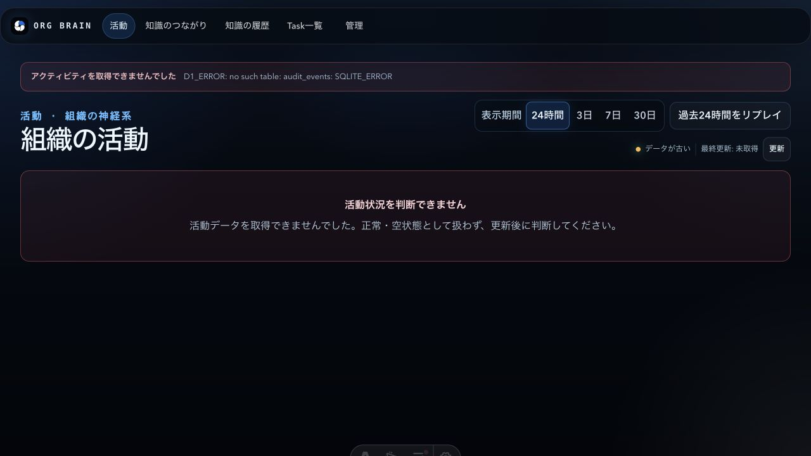
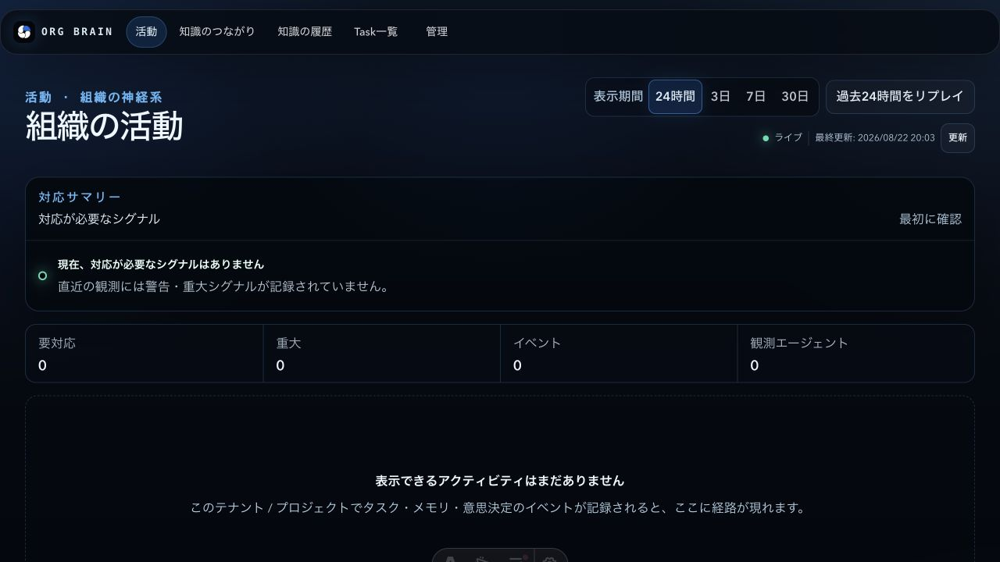
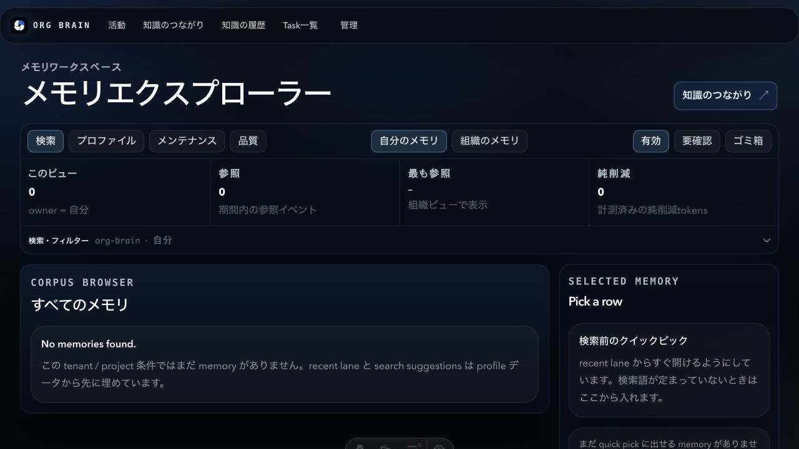
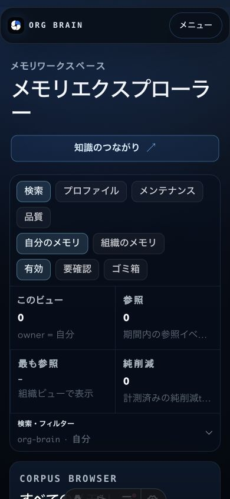
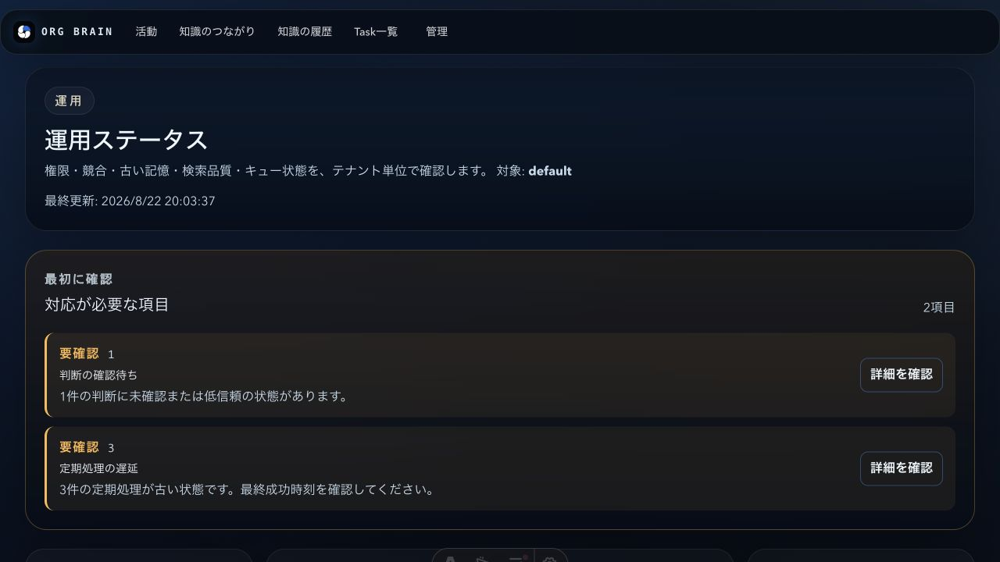
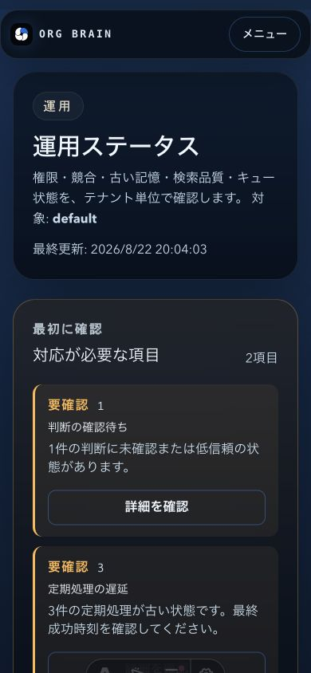

# OrgBrain 現状UX評価（2026-08-22）

## 結論

現行commit `4746fe70406656b4ec85fec485033dc4be5d4303` を対象に、製品コード・公開API・スキーマを変更せず、現行画面、CLI、ローカルD1、既存E2E、読み取り専用Cloudflare確認を実施した。

総合点は **71.0 / 100（暫定）**。Cloudflare初回セットアップ（coverage 57.14%）とチーム利用（coverage 57.89%）は、N/Aを0点扱いせず測定できた項目だけで再正規化したが、90%未満のため暫定である。

| 領域 | 重み | 領域点 | coverage | 判定 |
| --- | ---: | ---: | ---: | --- |
| ローカル初回セットアップ | 15% | 75 | 100% | 確定 |
| Cloudflare初回セットアップ | 20% | 65 | 57.14% | 暫定 |
| AI提案・失敗回避UX | 30% | 75 | 94.12% | 確定（Cloudflare parityはN/A） |
| 管理画面・一人利用 | 15% | 75 | 100% | 確定 |
| 管理画面・チーム利用 | 20% | 65 | 57.89% | 暫定 |
| **総合** | **100%** | **71.0** | — | **暫定** |

平均点に埋めないリスクは次のとおり。

- **P0（評価上のリリースブロッカー）**: Remote MCP OAuth、cloud hook enrollment、別ユーザーによる共有メモリ、チームの共有/制限境界を完遂確認できていない。設定されたURLの `/api/mcp` は401、OAuth discovery候補は404で、rootはOrg Bus Dashboardを返した。
- **P0（AI安全性/有用性）**: Local MCP fixtureの正常系にも `abstention_recommended=true` と `structured_extractor_degraded` が返った。根拠を隠さず安全側に倒れる一方、有用な提案まで抑制するため、正常系と根拠不足系を分ける改善が必要。
- **P1**: インストール済みCLIは `cloud doctor/cloud provision`、現行ソースは `cf doctor/cf provision` を表示し、checkoutのREADME経路とグローバル実体がずれる。初回導入で誤ったコマンドへ進む可能性がある。
- **P1**: ローカルAPIは未適用migrationのまま起動すると `audit_events` 等で500になった。APIと同じpersist-toへmigrationを適用すると200の正直な空状態へ復旧できるが、初回セットアップ手順にこの順序が必要である。
- **P1**: `wrangler whoami` の既存OAuth tokenはD1/Workers/Queues等の広いwrite scopeを持つ。最小権限トークンの作成・失効はこの実査では行っていない。

## 評価範囲と判定ルール

各項目は5点刻みの0〜100点で採点した。100は迷いなく完遂、85は軽微な迷い、70は明確な摩擦、50はドキュメント/再試行/回避策が必要、25は頻繁な失敗、0は完遂不能または安全に利用できない状態である。操作結果、所要時間、操作数、再試行、再現手順、重大度、verification stateを `scorecard.json` に項目ごとに付けた。

`implemented` はコード/画面に存在すること、`local_checked` はこのcheckoutで実行または目視確認したこと、`cloudflare_checked` は既存Cloudflareへの読み取り専用確認をしたこと、`unverified` は実行条件が成立せず推測採点していないことを表す。N/Aは領域点の分母から除外した。

## 実査環境

- OS: macOS arm64、Node `v22.23.2`、pnpm `10.16.1`、Wrangler `4.80.0`。
- `pnpm install --frozen-lockfile` は初回のsandbox DNS制約で失敗し、承認済みの再実行で完了。root CLI symlinkはdist不在のため作成されず、source CLIを直接実行した。
- 新規SQLiteを `/private/tmp` に作成してLocalを実査。製品DB、実ユーザー、Codex生セッションログは成果物に保存していない。
- ローカルAPI/Consoleは `127.0.0.1:8787` / `127.0.0.1:4321` で起動。APIが使うpersist-toへmigration `0001`〜`0037`（40本）をローカル適用した。
- Cloudflareは現行ソースのdoctor/live、provision dry-run、Wranglerのidentity/resource list、設定URLの公開status probeのみ。remote execute、deploy、D1/R2/Queueの作成・削除、既存データの書換えは行っていない。

開発サーバーのHMR中にViteが一度 `Failed to load url astro:server-app.js` を出したが、その後のoverview/APIは200に復帰した。これは開発サーバー固有の観測として `browser-diagnostics.json` に残し、製品スコアの失敗には数えていない。

## 実査手順と現行画面

1. commit、Node/pnpm、CLI実体、environmentの設定URLを記録した。現行source helpとインストール済みhelpの `cf`/`cloud` 差分を確認した。
2. 新規DBで `init → doctor → memory capture → memory search` を実行し、capture後の検索成功を確認した。doctorはDB directory 700、database 600を返した。
3. Codex MCP/minimal-hooks、remote-MCP、cloud-hooksのconnectorはdry-runのみ行い、実設定・hook・credentialは適用しなかった。
4. ローカルAPI起動直後の未適用migrationエラーを記録し、APIが使用するpersist-toへmigrationを適用して空状態の200を再確認した。
5. Desktop 1280x720でoverview、memory map、history、tasks、memories、organization、users、groups、client installations、operations、profile、decisionsを目視確認した。
6. Mobile 390x844でoverview、memories、users、operations、decisionsを確認した。200%相当、keyboard、forced colors、axe、横スクロールは既存E2Eで確認した。
7. Local MCP fixture（正常一致、失敗パターン、競合、低信頼、期限切れ、根拠なし、権限境界、過剰候補）を各3回実行した。Cloudflare側の同一fixtureとCodex実会話は、対象endpoint/OAuthの不一致によりN/Aとした。
8. 既存E2Eを実行し、mock APIを使った自動検証と、現行ローカルAPI/画面の実測を区別した。
9. scorecardからN/Aを除外して領域点と重み付き総合点を再計算した。P0は平均点と別に表示した。

### 現行画面の証拠

マイグレーション前は、画面が正常・空状態と誤認させず `D1_ERROR: no such table: audit_events` をalertに出した。これは復旧順序の案内が不足する一方、データがないことと障害を混同しない点は良い。

正しいpersist-toへmigrationを適用した後は、ライブ時刻、対応サマリー、0件の空状態、次の観測条件が表示された。

メモリエクスプローラーは範囲・状態・品質を同一画面で切り替えられるが、空状態に英語の `No memories found.` / `Pick a row` が残る。モバイルでは上部メニューに畳まれ、カードは縦積みになる。

運用画面は「最初に確認」を上部に置き、判断確認待ちと定期処理遅延を2件として明示した。個人利用では情報量が多く、権限・検索品質・ガバナンスまで同一ページに並ぶ。

## 領域別評価

### 1. ローカル初回セットアップ — 75 / 100

11項目を測定し、coverageは100%。新規DBから検索成功までのCLI経路は短く、doctorのファイル権限も安心材料になる。一方、グローバルCLIの世代差、migration適用順、hook trust/approvalが初回の摩擦である。

| 評価軸 | 点 | 証拠 | 状態 |
| --- | ---: | --- | --- |
| Local / Cloudflare / Managed選択 | 80 | L-01, L-03 | local_checked |
| Node・pnpm前提 | 75 | L-01, L-03 | local_checked |
| インストール短さ/成功率 | 65 | L-01 | local_checked |
| init/doctor | 90 | L-01 | local_checked |
| capture→search | 85 | L-01 | local_checked |
| Codex接続 dry-run/apply/確認 | 75 | L-02 | local_checked（dry-run） |
| Time to First Value | 80 | L-01 | local_checked |
| 成功状態/次の行動 | 85 | L-01, L-02 | local_checked |
| 復旧（Node/権限/古いCLI/競合） | 50 | L-03, L-04 | local_checked（部分） |
| DB/プライバシー/バックアップ | 85 | L-01 | local_checked（restore未検証） |
| restart/hook/保守 | 60 | L-02, L-03 | local_checked（適用未実施） |

### 2. Cloudflare初回セットアップ — 65 / 100（暫定）

14項目中8項目を読み取り専用で測定。現行の設定整合性、live authentication、dry-run計画、resource listは確認できた。execute、OAuth、cloud hook、別ユーザー共有は、対象URLがOrgBrain Consoleとして確定せず、認証を推測して実行しなかった。

| 評価軸 | 点 | 証拠 | 状態 |
| --- | ---: | --- | --- |
| Cloudflare知識/権限 | 75 | C-01, C-03 | cloudflare_checked |
| 最小権限token | 35 | C-03 | cloudflare_checked（広いscope） |
| env/Wrangler準備 | 75 | C-01, C-04 | cloudflare_checked |
| cf doctor/live | 85 | C-01 | cloudflare_checked |
| provision dry-run | 80 | C-02 | cloudflare_checked |
| provisioning進捗 | 30 | C-02 | cloudflare_checked（dry-runのみ） |
| 冪等性/部分失敗 | 50 | C-02 | cloudflare_checked（計画のみ） |
| deploy順序/依存 | 75 | C-02 | cloudflare_checked |
| Console初回ログイン | N/A | C-04 | unverified |
| Remote MCP OAuth | N/A | C-04, C-05 | unverified |
| cloud hook enrollment | N/A | C-05 | unverified |
| 別ユーザー共有メモリ | N/A | C-04, T-01 | unverified |
| 認証/期限切れ/障害復旧 | N/A | C-05 | unverified |
| deploy後smoke/運用準備 | N/A | C-02, C-04 | unverified |

`cf doctor --live` は認証済みで通過したが、これはOAuth tokenが使えることの証明であり、最小権限・Remote MCP OAuth・共有メモリの成功証明ではない。`cf provision --execute` は既存本番資源に対する変更範囲が広いため、今回のUX評価では行っていない。

### 3. AI提案・失敗回避UX — 75 / 100

17項目中16項目をLocal MCP直呼びで測定し、8シナリオを3回ずつ実行した。正常系でも根拠ID・ref・日時が追跡でき、失敗パターンには具体的な再試行前チェックが返る。反面、ローカルの依存未設定が正常系にもabstentionを強制し、Codex会話で提案が採用されたかを記録するUIは未接続である。

| 評価軸 | 点 | 証拠 | 状態 |
| --- | ---: | --- | --- |
| 提案タイミング | 70 | AI-01 | local_checked（direct MCP） |
| 関連性 | 85 | AI-01 | local_checked |
| ノイズ | 75 | AI-01 | local_checked |
| 行動への具体性 | 85 | AI-01 | local_checked |
| なぜこの提案か | 60 | AI-01 | local_checked（部分） |
| 根拠/参照元/日時/ID | 85 | AI-01 | local_checked |
| 信頼度/不足情報 | 85 | AI-01 | local_checked |
| 根拠不足時の抑制 | 90 | AI-01 | local_checked |
| 競合/期限切れ/低信頼警告 | 80 | AI-01 | local_checked（明示UI未接続） |
| 過去失敗パターン | 85 | AI-01 | local_checked |
| 回避チェックリスト | 70 | AI-01 | local_checked（部分） |
| tenant/project/権限境界 | 70 | AI-01 | local_checked（adversarial未実施） |
| MCP/認証/検索失敗復旧 | 50 | AI-01, C-04 | local_checked（部分） |
| 簡潔さ/コンテキスト | 80 | AI-01 | local_checked |
| 3回実行一貫性 | 95 | AI-01 | local_checked |
| Local/Cloudflare意味一致 | N/A | C-04, T-01 | unverified |
| 採用結果の記録 | 50 | AI-01, B-02 | local_checked（usage_idのみ） |

シナリオ別の全結果（fixture、期待挙動、3回の結果、Cloudflare差分）は `ai-scenarios.json` に保存した。期限切れ、権限外、根拠なしでは0件/abstentionを返す一方、正常系・失敗系では `onnx_embedding_not_configured`、`cross_encoder_not_configured`、`gemini_structured_extractor_not_configured` が常時露出した。

### 4. 管理画面UX・一人利用 — 75 / 100

14項目を現行画面とmock API E2Eで測定。ナビゲーション、空/部分/エラー状態、モバイル再配置、判断traceの導線は良い。個人scopeでも組織管理の入口が残り、operationsとmemory explorerの情報量が多い。

| 評価軸 | 点 | 証拠 | 状態 |
| --- | ---: | --- | --- |
| 初回状態 | 80 | B-01, L-04 | local_checked |
| IA/ナビゲーション | 80 | B-01 | local_checked |
| Dashboardの次行動 | 80 | B-01, B-02 | local_checked |
| メモリ検索/比較 | 75 | B-01, B-02 | local_checked（現行空データ） |
| 詳細/根拠/履歴 | 75 | B-01, B-02 | local_checked（mock含む） |
| 作成/改訂/抑制/復元 | 70 | B-02 | local_checked（抑制/復元未実行） |
| Decision/Task/Memory移動 | 80 | B-01, B-02 | local_checked |
| Profile/接続管理 | 80 | B-01, L-02 | local_checked（credential未発行） |
| 空/読込/部分/エラー | 85 | B-01, L-04, B-02 | local_checked |
| 操作数/スクロール/距離 | 70 | B-01, B-03 | local_checked |
| mobile/200%/横スクロール | 85 | B-02, B-03 | local_checked |
| keyboard/focus/VoiceOver/contrast | 75 | B-02 | local_checked（VoiceOver未実施） |
| 信頼度/利用状況/影響 | 70 | B-01, AI-01 | local_checked（データ疎） |
| 個人利用での管理過剰 | 65 | B-01, B-03 | local_checked |

### 5. 管理画面UX・チーム利用 — 65 / 100（暫定）

19項目中11項目は、空のOrganization/users/groups/client-installations/operations画面とresponsive/E2Eの構造を測定した。owner/admin/member 1/1/6、groups 3、projects 2、共有/制限メモリの実データセットを作っていないため、招待→ログイン、複数ユーザーのアクセス境界、レビュー責任、handoff、危険操作の多くはN/Aである。

| 評価軸 | 点 | 証拠 | 状態 |
| --- | ---: | --- | --- |
| Organization初期設定 | 60 | B-01 | local_checked（保存未実施） |
| 招待→初回ログイン | N/A | T-01 | unverified |
| owner/admin/member理解 | 65 | B-01, B-02 | local_checked（構造のみ） |
| ユーザー状態/権限変更 | N/A | T-01 | unverified |
| グループ/所属 | 60 | B-01, B-02 | local_checked（所属未実施） |
| tenant/project現在地 | 70 | B-01, B-02 | local_checked |
| 共有範囲/アクセス可視性 | N/A | T-01 | unverified |
| 所有者/登録元/根拠 | N/A | T-01 | unverified |
| Decisionレビュー/責任 | N/A | T-01 | unverified |
| Task/handoff/失敗共有 | N/A | T-01 | unverified |
| client credential lifecycle | 55 | B-01, C-05 | local_checked（dry-run） |
| 操作履歴/障害/停滞 | 70 | B-01, B-02 | local_checked（actor別未確認） |
| 複数ユーザーから探す効率 | N/A | T-01 | unverified |
| 危険操作/取消/復旧 | N/A | T-01 | unverified |
| 空/部分/拒否/エラー | 80 | B-01, L-04, B-02 | local_checked（拒否は構造確認） |
| mobile/200%/横スクロール | 85 | B-02, B-03 | local_checked |
| keyboard/VoiceOver/axe | 80 | B-02 | local_checked（VoiceOver未実施） |
| 日本語/非技術ユーザー理解 | 75 | B-01, B-03 | local_checked |
| 一人利用との差分 | 40 | B-01, B-03, T-01 | local_checked（team実データなし） |

## 自動テストと実画面の相違

既存E2Eは次のとおりすべてpassしたが、これらはmock API/fixtureであり、Cloudflare本番のOAuth・D1データ・実ユーザー境界を証明しない。

| Suite | 結果 | 測定対象 |
| --- | --- | --- |
| accessibility + keyboard + identity + login-and-memory | 70 passed / 0 failed | axe A/AA、横スクロール、200%相当、forced colors、keyboard、管理/認証フロー |
| dashboard-visualizations | 36 passed / 0 failed | activity/Strata/3D map/Task/Operations、失敗回避、narrow/mobile |
| decision-console-v2 | 25 passed / 0 failed | Decision map、trace、skills/agents/reviews、mobile、axe |
| **合計** | **131 passed / 0 failed** | 自動検証のみ。VoiceOverとCloudflare実データは未検証 |

## 改善バックログ

| 優先度 | 改善 | 影響評価軸 | 期待上昇点（目安） | 完了条件 |
| --- | --- | --- | ---: | --- |
| P0 | Remote MCPの正規endpoint、OAuth discovery、login/401/expiry復旧を一本化 | cf.9–14、ai.13/16、team.7 | Cloudflare領域をN/Aから実測へ | 同一fixtureをLocal/CF各3回、別ユーザー共有まで証拠化 |
| P0 | AIのdegraded判定を「根拠あり正常系」と「構造抽出不足」に分離 | ai.1/5/7/8/9/14/15 | AI +10〜15 | 正常系は根拠付き提案、根拠不足だけabstention、理由を短く表示 |
| P1 | source CLIとインストール済みCLIのコマンド名/バージョンを同期 | local.1/2/3/9、cf.4 | Local +10 | checkoutのbinがsourceと同じcf helpを返す |
| P1 | local API起動時にmigration不足をdoctor/画面で案内 | local.4/8/9、solo.1/9 | Local +5、solo +5 | 500の前に「migrationを適用」手順と再確認コマンドを表示 |
| P1 | Cloudflare tokenの最小権限テンプレート、失効、監査ログを提供 | cf.1/2/13、team.11 | CF +10 | read/write scopeを分離し、期限切れを安全に再発行 |
| P1 | team fixtureでowner/admin/member、group/project、共有/制限、handoffを再実査 | cf.12、team.2/4/7–10/13–14/19 | Team +15〜20 | 19項目のcoverage 90%以上、招待から共有利用まで実測 |
| P2 | 日本語画面の英語残存（No memories found/Pick a row/Task）を統一 | solo.1/2/13、team.18 | Solo/Team +5 | ja localeで主要empty/detailを日本語化 |
| P2 | 個人scopeでは管理項目を折りたたみ、次の行動を優先表示 | solo.3/10/14、team.19 | Solo +5 | 個人/チームのnavとDashboardの差分をfixture比較 |
| P2 | VoiceOver実機/スクリーンリーダーとreduced-motionの手動証拠を追加 | solo.12、team.17 | アクセシビリティの証拠強化 | VoiceOver操作ログと代表画面の修正前後を保存 |

## 成果物と証拠制約

- `scorecard.json`: 75項目の点/N/A、測定値、重大度、verification state、領域点、重み、再計算式。
- `setup-metrics.csv`: CLI/サーバー/ブラウザ/E2E/Cloudflare probeの時間、操作数、再試行、エラー。
- `ai-scenarios.json`: fixture、期待挙動、Localの8シナリオ×3回、未実行シナリオ、Cloudflare差分/N/A。
- `browser-diagnostics.json`: localの初期500→migration後200、browser console/network、公開endpointのstatusとbody shape。秘密・実ユーザーペイロードは含めない。
- `created-resources.md`: local-only migration/temp DB、Cloudflare読み取り専用確認、未作成/未削除の記録。
- `screenshots/`: 01〜19は現行ローカル画面。古い録画・過去レポートは証拠にしていない。

スクリーンショットだけでWCAG準拠とは判定していない。axe A/AA、keyboard、forced colors、横スクロール、200%相当は既存E2Eの結果として記録し、VoiceOver、Cloudflare実ユーザー、Remote MCP OAuthは未検証である。
