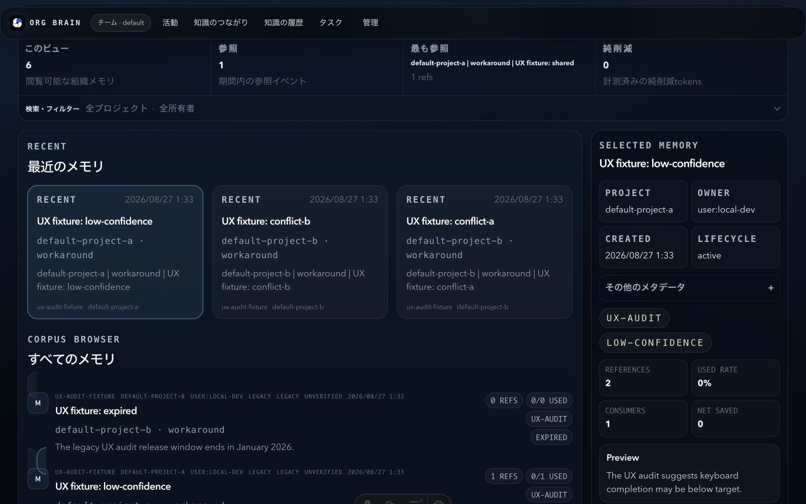
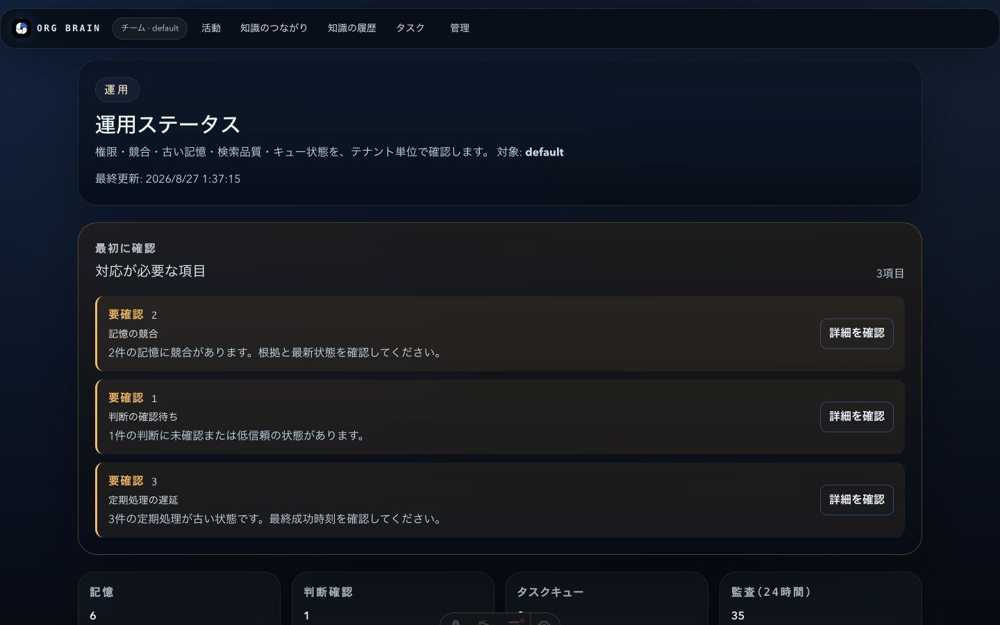
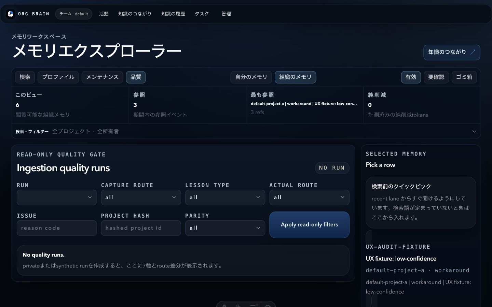
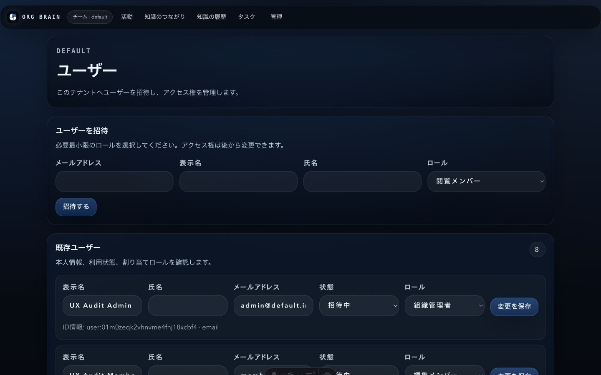
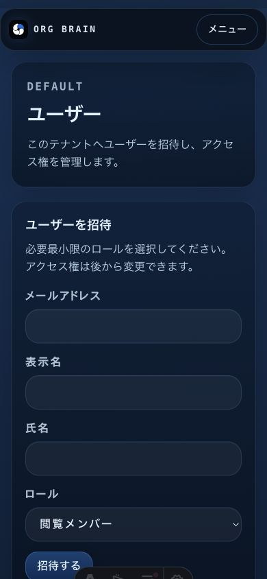
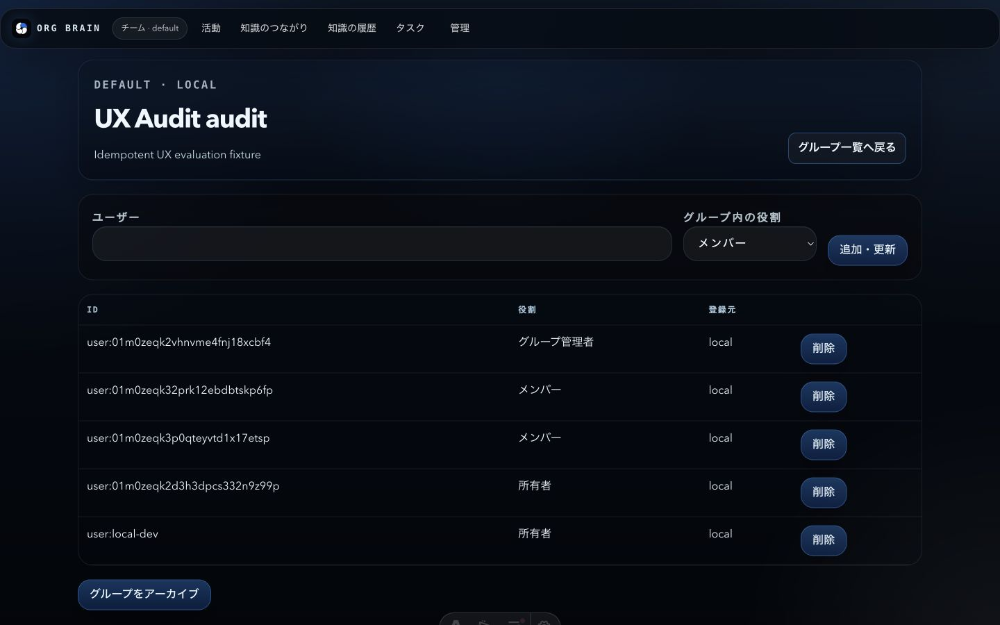
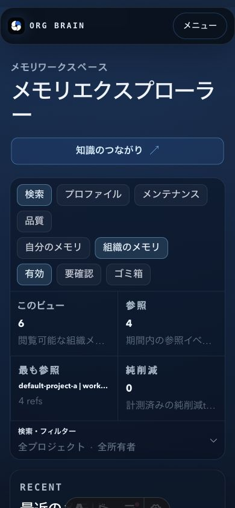

# OrgBrain UX再評価：AI経由の利用と管理画面

評価日: 2026-08-27  
Commit: `629490eb6922bfa2213cb21cff7c409d5a65af11`  
評価方法: [PRODUCT_UX_EVALUATION_METHOD.md](../../../../docs/PRODUCT_UX_EVALUATION_METHOD.md) version 1.0.0

## 結論

今回確認できたのは、AIの「最終回答そのもの」ではなく、その手前にある検索・根拠判定・回答抑制の契約です。この部分は強く、Localで適用可能な11シナリオが各3回とも期待結果に一致しました。認証失敗の1シナリオは、Localに認証境界がないためN/Aです。自動証拠の上限を適用した検索・安全契約の参考値は92.0/100です。

ただし、実際のAIクライアントで最終回答を表示していないため、最新rubricの「簡潔さと行動性」は未検証の0点です。Local・Cloud parityも未検証の0点なので、正式な `ai_safety` 軸は50.6/100です。Domain Packの97点は、生成された回答用コンテキストMarkdownの内部契約点であり、ネイティブクライアント上の回答UX点ではありません。

管理画面の対象範囲内の診断指数は81.3/100です。最も良いのは「運用」画面で、最初に見るべき3項目、理由、件数、詳細導線が揃っています。一方、メモリの危険状態が通常項目に近く見えること、日本語画面への英語・内部値の混在、ユーザー数増加時の長い編集フォームが主な減点です。

この81.3点は、最新rubricのうち管理に関係する10軸を使った独自の対象限定診断であり、正式な14軸総合点ではありません。各下位項目のraw score、証拠方式、証拠上限、finding上限、最終点、証拠IDは [measurement-input-focused.json](measurement-input-focused.json) に記録しました。

## 対象限定スコア

| 対象 | 点 | 読み方 |
| --- | ---: | --- |
| Local検索・安全契約 | 92.0 | 適用可能な11シナリオが各3回一致。自動証拠の上限92 |
| 正式 `ai_safety` 軸 | 50.6 | 関連性92、簡潔さ0、根拠・抑制92、Local/Cloud parity 0 |
| 生成回答コンテキスト契約 | 97.0 | 4 Domain Pack共通。ネイティブAI回答ではない |
| 管理画面の対象限定診断 | 81.3 | 管理に関係する10軸だけの診断。正式総合点ではない |

## フロー1：AI経由の利用

1. 利用者がAIクライアントから、判断、障害パターン、過去知識を尋ねる。
2. OrgBrainが候補メモリと参照元を範囲内で取得する。
3. 根拠を「利用可能」「劣化」「競合」「不足」として判定する。
4. 根拠が足りる場合だけ回答用コンテキストを渡し、足りなければ回答抑制を推奨する。
5. AIクライアントが最終回答を生成し、利用者が参照元と不足情報を確認する。

今回検証できたのは1〜4です。正常、障害パターン、根拠不足、競合、低信頼、期限切れ、権限外、候補過多、複数セッション欠落、MCP停止、古い誤情報で期待結果と一致しました。手順5の最終回答表示、文章量、CTA、引用の見え方は未検証です。

また、通常のLocal結果は、ONNX embedding、cross-encoder、Gemini structured extractorが未設定のため `degraded` と記録されています。fallbackで期待挙動は守られていますが、実際の回答画面では「劣化中」を権威的に見せない表示が必要です。

## フロー2：管理画面

1. 「管理」からユーザー、グループ、メモリ、判断、運用のいずれかを開く。
2. ユーザーを招待・更新し、ロールを割り当てる。グループでは所属者を確認する。
3. メモリを検索し、状態、来歴、参照状況を確認する。
4. 判断の信頼度、確認状態、根拠、制約、履歴を同じワークスペースで確認する。
5. 「運用」で競合、判断レビュー、定期処理、権限、ガバナンスを優先順に処理する。

## 主なfinding

### F1 — Medium：メモリの危険状態に気づくのが遅い

低信頼、競合、期限切れのメモリが、主一覧では通常の有効知識に近い見た目です。「運用」画面では競合を正しく優先表示できていますが、メモリ検索から安全性判断までが一続きになっていません。

改善案: 危険状態をカードと詳細の上部に大きく固定表示し、既定では要確認レーンに分け、根拠・競合・期限の確認操作へ直接つなげる。

### F2 — Medium：日本語画面に英語と内部値が混在する

同じ日本語フロー内に `RECENT`、`SELECTED MEMORY`、`Ingestion quality runs`、`Capture route`、`all` などが残っています。操作はできますが、リスクを判断しながら内部モデルも翻訳しなければなりません。

改善案: 利用者向け概念は日本語に統一し、route名や内部値は展開式の「技術情報」へ移す。メモリ、知識、判断、根拠の用語表も統一する。

### F3 — Medium：ユーザー管理が人数増加に耐えにくい

招待フォームは明快ですが、既存ユーザー全員が完全な編集フォームとして縦に並びます。検索、状態フィルター、ロールフィルター、ページング、一括操作が見当たりません。8人でも長く、モバイルでは既存ユーザーへ到達する前に招待フォームがほぼ1画面を使います。

改善案: 既定表示を検索・絞り込み可能な一覧にし、1人の編集はサイドパネルへ移す。一括変更は明示的な選択モードだけで提供する。

### F4 — Medium：グループ所属が人よりシステム中心に見える

グループ詳細は `user:...` のprincipal、`local`、削除操作を前面に出します。追跡性はありますが、管理者が「誰なのか」「なぜこのアクセスがあるか」「外すと何が見えなくなるか」を判断しにくい表示です。

改善案: 表示名とメールを主表示にし、principalは技術情報へ移す。直接付与と継承を分け、削除確認ではアクセス喪失対象を示す。

### F5 — Low：レスポンシブは良いが、操作領域とアクセシビリティ証拠が不足する

実査した390x844のユーザー・メモリ画面には横スクロールがなく、表示中のフォーム操作には名前がありました。一方、ナビゲーションやfilterの一部は36〜40 CSS pxで、基準の44pxを下回ります。Playwrightのaxe等はmock-proxy経路で `Network connection lost` が発生しVite overlayが出たため、製品の合否を判定できませんでした。VoiceOverも未実施です。

改善案: 操作領域を44px以上へ揃え、mock-proxy経路を復旧したうえでoverlayなしのaxe、キーボード、VoiceOverを再実施する。

## 良かった点

- 「運用」は「最初に確認」から始まり、件数、影響、詳細導線が1項目内に揃う。
- 判断編集では、信頼度、確認状態、根拠、鮮度、制約、履歴を同じ画面で追える。
- メモリのゴミ箱が復元可能で、永久削除はID確認が必要だと画面上で説明している。
- 実査したモバイル2画面はページ全体の横スクロールなしでreflowした。
- 招待時の既定ロールが最小権限の閲覧で、後から変更できることも明記されている。

## 改善の優先順位

1. 低信頼、競合、期限切れ、未確認をメモリ検索と詳細で見逃せない表示にする。
2. ユーザー管理を、繰り返しフォームから検索・絞り込み・単票編集へ変える。
3. 日本語用語を統一し、内部値を技術情報へ分離する。
4. グループのアクセス変更を人中心にし、削除前に影響範囲を示す。
5. mock-proxy経路を直し、axe、全keyboard、VoiceOverの証拠を取り直す。

## 証拠と限界

- 現行画面のスクリーンショット11件を保存し、画面所見の根拠として使用した。
- 評価用fixtureは8ユーザー、3グループ、8ロール割当、6メモリ。manifestは6メモリのtrash、8割当の削除、3グループのarchive、8ユーザーのdeprovisionを記録している。独立したDB readbackは未実施。
- AIは適用可能な11シナリオが各3回一致。認証失敗1件はLocalではN/A。
- 4 Domain Packは想起100、生成回答コンテキスト契約97。最終AI回答のUXではない。
- focused Node testは9件pass。
- Playwrightはmock-proxy経路の失敗により、axe、管理変更、品質画面の製品結果を判定不能とした。
- 未検証: Cloudflare live parity、VoiceOver、ネイティブAIクライアント回答、live model A/B、英語・中国語構造一致、performance benchmark。

証拠対応表は [evidence-index.md](evidence-index.md)、コマンド結果の要約は [command-results.json](command-results.json)、採点内訳は [measurement-input-focused.json](measurement-input-focused.json) を参照してください。
