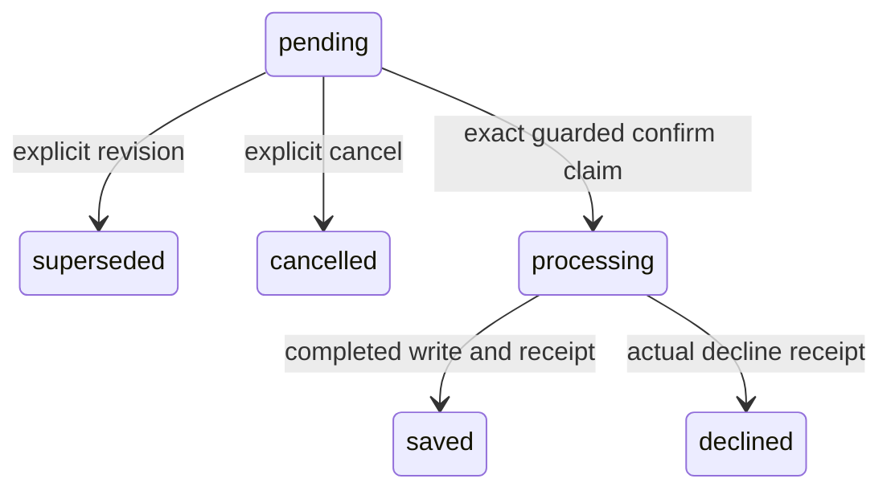

# Cloud candidate lifecycle and typed memory

Apply additive migration `0047_memory_confirmation_lifecycle.sql` before using
these Cloud routes/tools. This change runs only against code and synthetic local
fixtures in validation; no production migration or real pending mutation occurred.
The optional server-core ports leave unsupported backends at 501.

## Review lifecycle

Preview `orgbrain_conversation_memories_stage` (REST `POST /v1/memories/conversation-stage`)
with an explicit v1 conversation envelope. Execute needs its unchanged plan hash.
The pending receipt contains token, candidate hash, revision and guard requirement.
Display the canonical candidate and obtain an actual answer before confirm:

```json
{
  "confirmation_token": "<displayed token>",
  "expected_candidate_hash": "<displayed 64-character hash>",
  "expected_revision": 1,
  "approved": true,
  "review_answer": "<actual user answer>"
}
```

For explicit replacement, preview `orgbrain_conversation_memories_revise` (REST
`POST /v1/memories/conversation-revise`) with the predecessor token/hash/revision
and a new single-candidate envelope. Execute additionally needs the new plan hash.
A single D1 batch inserts revision+1 and supersedes its predecessor. A new shown
candidate needs a new answer. A different ordinary stage event does not implicitly
replace another event. Identical retry keeps the successor/token/expiry; different
concurrent successors conflict. Old superseded tokens cannot activate.

`orgbrain_memories_confirmation_cancel` (REST `POST /v1/memories/confirmation-cancel`)
requires the token/hash/revision and a screened 1–500 character reason. It is terminal
and idempotent for the same reason. Confirm, revision and cancel arbitrate current
pending state atomically; a processing candidate cannot be revised/cancelled.
All routes enforce tenant, proposal owner, actual project and current permission;
REST additionally respects a bound caller project. Hook allowlists are unchanged.



If persistence fails, review state is failed while lifecycle remains processing.
An identical confirm retry may resume; uncertain processing is never cancellable.
A lost final receipt after the consumed completion marker is recovered from durable
rationale/task evidence without repeating the active write or increasing its version.
The existing multi-step persistence is not advertised as an all-or-nothing active
write transaction. Status/retry conflicts require inspection rather than an invented
answer or direct operational DB edit.

Migration leaves old payloads/IDs/answers/receipts unchanged. Old rows and direct
legacy proposals use `managed_review=0`: their previous unguarded confirm contract
remains compatible, while provided guards are checked. New conversation stages and
all explicit revision successors use `managed_review=1` and require both guards.
Legacy saved request hashes remain replayable because absent new fields are excluded
from their hash. Old pending lineage is not guessed or retroactively cancelled.

## Typed compatible fields

An optional `memory_type` is `lesson`, `playbook` or `task_constraint`; supplied
`scope` must match the envelope project. Old v1 envelopes retain their prior hashes.
A project playbook uses this bounded contract:

```json
{
  "memory_type": "playbook",
  "scope": {"level": "project", "project_id": "fixture-project"},
  "playbook": {
    "schema_version": "memory-playbook/v1",
    "sources": [{"ref": "repo:fixture-project/skills/job/SKILL.md", "version": "fixture-v1", "content_hash": "sha256:<64 lowercase hex>"}],
    "prerequisites": "Read the cited skill and its mandatory safe read gate.",
    "steps": [{
      "command": {"executable": "fixture-jobctl", "args": ["status", "--job", "<current-job-id>"], "tool_version": "fixture-v1"},
      "expected_output": "Current authorized scope and status fields",
      "stop_when": "Scope or version mismatch",
      "on_failure": "Follow the cited skill; optional denial grants no new IAM"
    }],
    "refresh_when": "Refresh the cited section when source or tool version changes"
  }
}
```

Sources: 1–3; steps: 1–4; serialized normalized playbook: at most 3000 characters.
The exact read-template allowlist is fixture-jobctl status, gcloud run jobs describe
and gcloud logging read with current-target placeholders. Fixed targets, unsupported
write commands, shell syntax, unsafe instructions and sensitive metadata are rejected.
Command validation means template checking only (`template_checked_unverified`).
Source versions/hashes are caller supplied and remain `supplied_unverified`; no
fetch/execution receipt is generated. Caller cannot set verified state. Recheck
current authorization, target, tool/source version and task limits before action.
Typed content corrections must use revision; a free-text correction cannot silently
change the displayed structured contract. Full prerequisite/step/stop/failure/refresh
text is packed atomically or omitted when the context budget is insufficient.

Task constraints instead require `claim_type: user_decision`, a user source,
`scope: {level: task, project_id, task_key, expires_at}` and `task_constraint` with
`decision_key` plus bounded `max_calls` and/or `max_cost` (USD). Expiry must follow
occurred_at by at most seven days. Actual review writes only a scoped commitment,
not durable memories/FTS. It reports `active_memories_created: 0` and no execution
permission. A mixed envelope may explicitly separate lesson and constraint candidates;
there is no free-prose classifier/splitter. Legacy local execute rejects the new typed
playbook/task contracts before queueing; the Cloud backend owns this extension.

## Contextual resume

For literal “再開して”, “再開してください”, “resume”, “resume this/the task”, search
or retrieve-context requires explicit `task_context: {project_id, task_key, subject_query}`.
Project must equal the request project and supplied task_id must equal task_key.
The existing bounded lexical planner searches only subject_query. Missing/unknown
subject, mismatched task/project, history/suppressed or incompatible generation/entity
filters abstain. ACL/project/expiry/source/conflict gates run before the row bound;
coverage is rechecked on final injected content. Caller-supplied context is guidance,
not verified task state or automatic conversation synchronization.

Trusted command/source verification, real OAuth MCP E2E, native delivery collection,
free-prose scope inference, general imperative planning and actual token savings remain
outside the verified contract. No deployment, credentials or permissions were changed.
