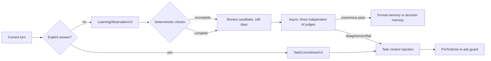

# OrgBrain Memory Contract v2

This document is the executable contract for durable learning and task
continuity. It is intentionally agent-independent; the Codex adapter is the
first adapter that enforces it.

## Design rule

Define the record that will be safe to reuse first, then derive capture prompts,
hooks, verification, and storage from that record. A candidate is not active
knowledge until its evidence and lifecycle state say that it is safe to use.



## Layers

### `LearningObservationV2`

This is a current-turn candidate. It is never used as active context. The
agent supplies only semantic fields; hooks and the API add identity, hashes,
scope, producer, prompt/verifier versions, timestamps, TTL, quality, ACL, and
lifecycle state.

The common semantic envelope is:

```json
{
  "record_type": "learning_observation",
  "schema_version": 2,
  "lesson_type": "success | decision | failure",
  "capture_intent": "verify | review",
  "trigger": "what made this reusable",
  "applicability": { "target_files": [], "components": [] },
  "evidence_selectors": [],
  "gaps": []
}
```

The type-specific required fields are:

- `success`: `procedure`, `why_it_worked`, `observed_outcome`, `reuse_when`.
- `decision`: `decision_type`, `decision_key`, `question`, an exact
  `selected_value` or `decision`, and applicability. `implementation` and
  `governance` also require `rationale` and `alternatives`. A user choice may
  use `rationale: null`; the agent must not invent a reason.
- `failure`: `symptom`, `failed_approach`, `root_cause`, `correction`,
  `verified_outcome`, and `avoidance_rule`.

### `MemoryUsefulnessAssessmentV1`

Every capture route uses one non-persisted assessment envelope. It returns
`route=active|quarantine|excluded`, reason codes, hard violations, and seven
independent 0–100 dimensions: semantic completeness, evidence support,
rationale quality, future reuse, scope specificity, freshness/validity, and
atomicity. No average score exists. `active` requires every dimension to be at
least 95, `capture_origin=observed`, verified evidence with `verified_at`, and
unanimous certified judges (three passes across at least two model families).

Credential, PII, absolute home path, raw transcript/reasoning envelope,
self-attested command result, expiry, duplicate, unresolved conflict, source
drift, scope violation, and non-atomic content are hard violations and can
never be active. Durable but incomplete or uncertified records are
`quarantine`; hard-violating or non-durable records are `excluded`.

Artifacts are references, not memory bodies. A source reference contains a
repository-relative path or HTTPS document URL, a `sha256:` content hash, and
a summary of at most 240 characters. A changed hash is `source_drift` and is
excluded from injection until reverified. `capture_origin` describes
observed/synthetic provenance; the independent `capture_route` records
`realtime_hook`, `initial_import`, `manual`, `repair`, or `legacy`, with an
optional route-specific `capture_batch_id`. Existing records backfill to
`legacy`.

`capture_intent=verify` is accepted only when the type-specific fields and
evidence are complete. `capture_intent=review` is retained as a redacted,
180-day candidate with honest `gaps` and cannot become active automatically.

### `TaskCommitmentV1`

This is the authoritative record for an explicit `request_user_input` answer.
It is scoped to one task and is kept separate from ordinary memory.

```json
{
  "record_type": "task_commitment",
  "schema_version": 1,
  "task_key": "codex:<session_id>",
  "decision_key": "agent_rollout",
  "question_fingerprint": "sha256:<64 hex chars>",
  "answer": { "option_id": "common_contract_codex_first", "label": "共通契約＋Codex先行" },
  "authority": "explicit_user",
  "confirmation_state": "user_confirmed",
  "ask_policy": "reuse_until_superseded",
  "scope": { "level": "task", "project_id": "org-brain" },
  "evidence": { "type": "request_user_input_result", "digest": "sha256:<64 hex chars>" }
}
```

For a given tenant, task, and `decision_key`, the database permits one active
version. A changed answer supersedes the old version and creates a new
immutable version. Expiry, an explicit change request, scope change, or
conflicting current evidence permits a new question.

## Prompt and hooks

The single source of truth is the manifest at
`packages/shared/src/memory-contract-v2-contract.mjs`, which binds the
versioned prompt, the JSON Schema source digest, the reason-code dictionary
digest, the verifier version, and the three judge profiles into one contract
hash. Its inputs are
`packages/shared/src/memory-contract-v2-runtime.mjs`,
`packages/shared/schemas/memory_contract_v2.schema.json`, and
`packages/shared/src/memory-contract-v2-reason-codes.mjs`. Run
`pnpm contract:check` in CI; it fails when the schema, prompt, judge
families, reason codes, v3 ingestion fixture, or manifest hash drift. The runtime normalizer is the semantic
verifier; the JSON Schema is the deterministic AI input boundary; and the
reason-code dictionary is the stable reporting vocabulary. The shared package
also exposes the Ajv validator so local MCP, API MCP, and adapters cannot
silently invent a second input contract. The versioned prompt explicitly says
to reuse injected commitments, never re-ask an answered decision, avoid
rationale invention, and use `review` when evidence is incomplete.

The Codex installer configures:

| Event | Matcher | Purpose | Timeout | Context |
| --- | --- | --- | ---: | ---: |
| `SessionStart` | — | Restore task commitments and context | 2s | 8192 B |
| `UserPromptSubmit` | — | Inject commitments and capture prompt | 3s | 8192 B |
| `PreToolUse` | `request_user_input` | Deny exact answered questions | 1s | — |
| `PostToolUse` | `request_user_input` | Persist UI answer immediately | 2s | — |
| `PreCompact` | — | Checkpoint task commitment capsule | 3s | — |
| `PostCompact` | — | Re-inject commitments after compaction | 2s | 8192 B |
| `Stop` | — | Verify and batch current-turn learning | 5s | — |

Hook code does not call an LLM, discover tools, or store raw transcripts. The
answer hook writes the commitment to a 0600 local SQLite ledger first; a
learning-batch transport failure is retained in an idempotent outbox for seven
days. The
context payload is capped at 7168 bytes and is ordered by conflicts/change
requests, task commitments, project decisions, ordinary memory, and the
observation prompt. Records are never cut in the middle.

`task_commitment_semantic_aliases` is a separate, expiring index. It accepts
only an `ai_consensus_certified` result whose three judge records carry the
deployed judge prompt hash. PreToolUse denies a matching certified alias; a
newly similar question without that attestation remains warning-only.

## Evidence and deterministic verification

Evidence selectors support `command`, `file`, `doc`, `user_statement`, and
`tool_result`.

- Commands match a normalized command hash, never a substring.
- Files use repo-relative paths, content hashes, and the relevant diff.
- User input is linked to its exact question, option set, and tool-result
  digest.
- A final answer cannot attest its own command or tool result.
- Sensitive text, credentials, raw reasoning, raw transcripts, and absolute
  home paths are rejected or redacted before persistence.

The deterministic verifier checks schema, evidence selectors, command/file/
tool-result correspondence, scope, duplicate keys, sensitive data, prompt and
verifier hashes, and lifecycle transitions. Any incomplete candidate is
review-only. Even a complete deterministic candidate is first sent as a
review candidate with `ai_consensus_pending`; only the asynchronous judge
worker may return it as `verified_items` for active promotion.

Semantic checks use three independent, temperature-zero, version-pinned judge
profiles: evidence entailment, durability/atomicity, and future reuse/
overgeneralization. The producer is not used as a judge. A candidate is
`ai_consensus_certified` only when all three pass and at least two model
families are represented. Any disagreement becomes
`ai_review_pending/disagreed`; it is not resolved by majority vote.

Judge persistence contains only verdict, reason codes, supported selectors,
judge/model identity, and prompt hash—not reasoning text. The D1 migration also
blocks a candidate from entering `verified` unless three distinct passing judge
rows already exist; the application layer additionally checks exact profile,
family, prompt, verifier, and unanimity constraints.
The shared `runMemoryContractJudgeConsensus` function is the provider-neutral
worker boundary: a deployment supplies three independent model runners outside
the hooks, then submits only the certified verdict metadata to
`orgbrain_learning_batch_ingest`. Hooks never call those runners. Formal
implementation/governance decisions are promoted only to `decision_memories`;
ordinary success/failure records use `memories`, so the same decision is not
duplicated across both stores.

Retention tiers are explicit: redacted, AI-labelled real candidates are Silver
and expire after 180 days; only deterministic, re-anonymized oracle fixtures
are Gold and may be retained permanently in the locked evaluation corpus.

## Quality gates

`packages/shared/src/memory-quality-certifier.mjs` provides deterministic
measurement and certification helpers. Every measurement retains its `axis`
and `cohort`; no cohort is hidden by an aggregate score.

Judge qualification precedes measurement. The static decision table at
`packages/shared/test/fixtures/memory-ingestion-oracle-v1.json` contains 40
hand-labelled locked-test cases across contract normalization, evidence
verification, and final routing, plus eight metamorphic pairs. Its adjacent
`.sha256` file locks the semantic JSON. Labels are declared independently of
the runtime and the runner checks exact outcomes and reason codes. Run:

```text
pnpm memories:qualify-ingestion-oracle -- --output <private-oracle-report>
```

Any hash, label, relation, structure, duplication, or privacy mismatch makes
the judge `not_qualified`. A v2 quality certification requires this report;
generated regression measurements cannot replace it or qualify the judge that
scores them.

Production machine-reference qualification is a separate locked dataset. The
machine-reference command generates 1,200 blind synthetic candidates, keeps
expected routes out of the candidate bundle, and uses two shuffled passes of a
five-profile independent AI council before selecting 900 gold cases:
active/quarantine/excluded are each 300. Route precision/recall, route
accuracy, council stability, and at least 90 metamorphic pairs are reported
independently. Each metric needs a point estimate and Wilson lower bound of at
least 95%; provenance hashes and three distinct Ed25519 fingerprints are
sealed. Hard guardrails remain zero tolerance. The machine-reference report is
the autonomous input to `memories:certify-quality`; the legacy human
calibration artifact remains readable for compatibility only.

### Autonomous qualification and maintenance

The autonomous path uses a blind, independently generated machine-reference
set and a five-profile AI council spanning at least three model families. Two
shuffled passes must agree (active requires 5/5; quarantine/excluded require at
least 4/5 with zero hard-guardrail dissent). Disagreement is quarantined
rather than arbitrated into an active label. The sealed set is exactly 300
active, 300 quarantine, and 300 excluded.

Autonomous certification requires `ground_truth_basis=machine_reference`,
`human_grounded=false`, route precision/recall and accuracy at least 95% by
both point estimate and 95% Wilson lower bound, council repeat stability of at
least 99%, 90 or more metamorphic pairs with zero violations, zero hard
guardrails, and a passing observed-outcome canary. Missing evidence is
`insufficient_evidence`, not a failure that can be bypassed.

Workspace policy is versioned under `autonomy` with `shadow`, `guarded`, and
`autonomous` modes. Deterministic guardrails precede risk-tiered AI consensus;
judge denial, outage, rate limits, or disagreement route to `quarantine`.
Quarantine is re-evaluated automatically and expires to suppression after the
configured retention period. Cloud scheduled maintenance and the local
LaunchAgent share the same policy hash, mutation budget, post-apply doctor,
and automatic rollback. Physical deletion is permitted only by an explicit
retention policy, never by an AI quality verdict.

The primary KPIs are:

- `verified_knowledge_correctness`: active fields supported by admissible
  evidence.
- `durable_knowledge_coverage`: durable success/decision/failure events
  candidate-ized without omission.
- `decision_continuity`: an applicable commitment is reused without asking
  again. The same task and decision key re-ask is a hard zero-tolerance gate.

The existing seven axes remain independent gates:
structure/metadata, evidence/rationale, decision usefulness, retrieval
reproducibility, freshness/validity, duplicate/conflict control, and useful
coverage. Each cohort requires a point estimate of at least 95% and a 95%
Wilson lower bound of at least 95%. Re-ask rate additionally requires a 95%
Wilson upper bound of at most 5%.

The hard guardrails are zero tolerance for unsupported active records,
credential/PII leakage, cross-tenant or cross-scope injection, stale or
superseded application, final-answer self-attestation, canonical duplicates,
contract hash mismatch, and same-key re-asking.

Passing deterministic measurements alone does not certify the overall report.
Until the independent machine-reference council and observed-outcome canary
reach the required consensus, the overall certification remains
`not_certified` even when every deterministic record and hard guardrail passes.

Operational certification is separate from data quality: `PreToolUse` p95 must
be below 100 ms, `PostToolUse` p95 below 250 ms, `Stop` p95 below 2.5 s with a
5 s hard timeout, and a 200-turn smoke must have zero timeouts, API 5xx, and
Cloudflare 1102 responses. These gates are exposed by
`evaluateMemoryContractPerformance` and are not averaged into a quality score.

## Regression corpus and incident fixture

The locked corpus must keep sessions intact across train/dev/test and include
at least 75 success, 75 decision, 75 failure, 200 non-durable turns, 300
next-task retrieval cases, and 75 cases per continuity class (same key,
paraphrase, compaction/resume, and change/conflict/scope change). The
executable minimums are exported as `MEMORY_CONTRACT_CORPUS_MINIMUMS`, and a
v2 quality manifest without a passing corpus is insufficient evidence.

Only after both the conformance oracle and independent machine-reference
qualification are qualified, use the credential-free fixed-seed measurement definition at
`packages/shared/test/fixtures/memory-ingestion-regression-v3.json`, expanded
by `scripts/memory-ingestion-regression.mjs`. It generates all 1,037
minimum and review cases deterministically without copying a real Codex
transcript. It compiles every scenario to realtime-hook and initial-import
JSONL while writing expected routes only to a blind `oracle.json` sidecar.
Formal observe candidate hashes must match after route-only identity is
removed. Generated JSONL is disposable and never committed. Run
`pnpm memories:build-ingestion-regression -- --emit-sessions <private-dir> --check`
to inspect counts and privacy flags; `scripts/codex-session-import.test.mjs` validates the
corpus, active/review/excluded routing, plan privacy, and idempotent local
application.

The incident regression is:

1. Answer three structured questions.
2. Capture all three answers in `PostToolUse`.
3. Compact after removing the original tool result.
4. Submit only “作業を続けて”.
5. Restore the three commitments through `PostCompact`/`UserPromptSubmit`.
6. Assert that neither the exact nor paraphrased questions (with the same
   stable decision key) are issued again. A previously unseen semantic match
   is warning-only until an independent judge has certified it as an alias.

Additional cases cover supersede, cross-task IDs, MCP outage/local restore,
duplicate events, missing evidence, malicious final answers, secret redaction,
and context-size boundaries.

## Rollout and rollback

The migration and tools are additive and initially flag-off. Rollout order is
shadow hooks, recorded-only pre-tool decisions, locked-corpus gates, a 24-hour
`org-brain` canary, seven-day monitoring, then additional workspaces and
adapters. Daily jobs check deterministic constraints; weekly jobs break down
quality by lesson type, work type, agent, model, prompt contract, and hook
version. Contract, prompt, verifier, or model changes rerun the locked corpus.

If a metric drops by two points, a Wilson gate fails, or a hard violation
appears, promotion stops. Rollback disables forced guards and automatic active
promotion, suppresses new promotions, and retains candidates, versions, and
audit history.
