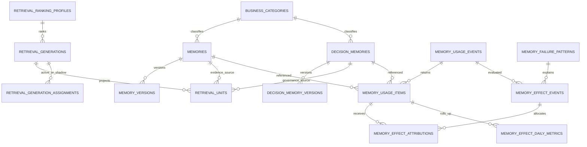

# Retrieval generations, business classification, and memory impact

## Contract

`memories` and `decision_memories` remain independent authoritative records.
The first stores facts, experience, and reusable knowledge; the second stores
decisions, rationale, rejected alternatives, constraints, and confirmation
state. Neither table is automatically copied into the other.

Both sources are projected into `retrieval_units`. Search returns them as two
channels:

- `evidence`: units whose source is `memories`.
- `governance`: units whose source is `decision_memories`.
- `both`: two separately ranked response sections. A confirmed, currently
  valid governance result is not displaced by an evidence score.

## ER diagram



`retrieval_units.source_type + source_id` and
`memory_usage_items.source_type + source_id` are polymorphic references. D1
does not express them as foreign keys; the service validates source existence
and tenant ownership before writing. Historical usage rows contain category,
work type, and quality snapshots, so later edits cannot rewrite past metrics.

## Explicit classification

Each new memory or decision memory accepts one tenant-owned
`business_category_id` and one `work_type`:

```text
implementation | review | debug | proposal |
support | research | operations | other
```

Payload values take precedence over workspace v2 defaults. Content-based AI
inference and an implicit default business category are prohibited. During the
compatibility phase, missing values remain `NULL` and the response includes a
`classification_warning`. Set `MEMORY_CLASSIFICATION_MODE=require` only after
clients and workspace mappings have been updated; missing values then fail with
`business_category_required` or `work_type_required`.

Categories are managed through `GET/POST/PATCH /v1/business-categories` or the
matching MCP tools. Used categories are deactivated, not deleted. Cross-tenant
and inactive category IDs are rejected.

The operator backfill is dry-run by default and accepts JSON or CSV:

```bash
pnpm cf:memory:backfill-classification -- \
  --input /secure/classification.csv --tenant tenant-a --export /secure/plan.json
```

Add `--apply` only after reviewing the exported plan. It validates tenant,
active category, source existence, fixed work type, and duplicate source rows,
then updates current records, version classification columns, decision version
snapshots, and stable retrieval snapshots. It never infers a value from text.

## Stable retrieval generations

Public clients choose `retrieval_profile=default|lexical|hybrid|structured` and
normally do not select a generation. Operators and benchmarks may supply
`generation_id` and `ranking_profile_id`; only the tenant/project active or
shadow assignment is allowed.

Generation status transitions are global control-plane operations and are
disabled unless the authenticated principal is explicitly listed in
`RETRIEVAL_OPERATOR_PRINCIPALS_JSON`. Tenant administrators may change only
their tenant/project assignments; they cannot mutate a shared generation.

`retrieval_generation_assignments` resolves an exact project key first and the
tenant `*` assignment second. Missing or invalid assignments fail closed when
`RETRIEVAL_GENERATION_ROUTING=enforce`. `observe` falls back to the legacy path
to support migration, and `legacy` leaves stable assignment routing disabled.

Create a new generation only when the extraction algorithm or unit schema
changes. Ranking weights and reranker settings create a ranking profile
without duplicating units. Ranking profiles are immutable snapshots, so each
tuning change creates a new profile. Embedding changes use a separate
`embedding_profile_id`. Responses identify the actual generation, unit schema
version, extractor, ranking profile, and embedding profile in
`meta.retrieval`. Governance retrieval applies the profile's
`rrf_constant` and `decision_weight` to reciprocal-rank fusion of lexical
candidates and structured decision scores; the profile is not metadata-only.

Operator control-plane endpoints are `POST /v1/retrieval-ranking-profiles`,
`POST /v1/retrieval-generations`,
`POST /v1/retrieval-generations/:id/backfill`, and
`PATCH /v1/retrieval-generations/:id`. Backfill is resumable through
`retrieval_projection_jobs`, supports an explicit reset, records source/unit
digests, and clones the selected baseline into a building or shadow generation.
Normal source writes then keep every assigned active/shadow generation current.
Project-scoped backfills include tenant-wide (`project_id IS NULL`) units.
Completion compares source and target record/unit digests; a concurrent baseline
change fails the job and requires `reset=true`, preventing a stale target from
being marked complete. Failed jobs cannot resume without that explicit reset,
and an expression-based unique index treats a tenant-wide NULL project as one
scope even under concurrent starts.

The seeded compatibility mapping is:

| Legacy alias | Generation label | Unit schema | Extractor version |
| --- | --- | --- | --- |
| `hybrid_v3` | `baseline_units` | `1` | `1` |
| `hybrid_v4` | `structured_context` | `2` | `4` |

The aliases are deprecated compatibility inputs only. Stable table and API
contracts do not include `v3` or `v4` names.

When an active assignment has a shadow generation, deterministic sampling uses
the assignment rate. The active result is returned; the shadow result stores
only query hash, generation IDs, counts, overlap, degraded/error state, and
latency in `retrieval_evaluation_events`.

A `shadow -> active` transition is rejected unless every matching projection
job is complete and operator-supplied, artifact-referenced promotion evidence
proves 100% coverage, digest equality, zero tenant/ACL/category violations,
non-degraded offline benchmark, empty/error deltas within 0.5 points, p95
latency within 1.15x, zero critical regressions, and at least seven shadow days.
Assigning an already-active generation to another tenant/project repeats the
scope-specific completed-job and seven-day evaluation checks, so a promotion in
one tenant cannot authorize an unbuilt scope.

## Usage and effect semantics

Every search, profile, context injection, or direct decision retrieval creates
one `memory_usage_events` row and returns `meta.usage_id`. Multiple units from
the same source are deduplicated in `memory_usage_items`; a source is therefore
counted once per usage event.

Effects are append-only. A later verification supplies
`supersedes_effect_id`, which must belong to the same tenant and usage event.
Reports use only the latest effect for a usage event and keep evidence levels
separate: `reported`, `estimated`, `verified`, `unverifiable`, and `unreported`.
Verified effects require an offline verification reference.

Callers close the reference-to-use funnel with
`POST /v1/memory-usages/state` or
`orgbrain_memory_usage_state_update`, assigning `used`, `not_used`, or
`unknown` to individual usage items. An attributed non-unknown effect marks
only its attributed items as used; it never changes unrelated items.
The internal state source distinguishes explicit reports from effect-derived
state, so superseding attribution clears only the prior derived state and does
not overwrite an explicit caller report.

`avoided_lookup_categories` supports `source_search`, `web_search`,
`past_context`, and `none`; `none` is exclusive. Gross and injected token
estimates are stored separately and net savings are `gross - injected`,
including negative values. One effect can be distributed across referenced
memories only when attribution weights total exactly `1.0`.

A same-failure avoidance counts only when an active tenant failure pattern is
explicitly applicable, the known action was stopped before execution, an
alternative was executed, and the failure was avoided. Unknown, unreported,
and not-applicable cases are excluded from the denominator.

The preferred token-estimation order is paired control, safe offline replay,
avoided source/context size, historical median for the same failure pattern,
calibrated category median, then text-size heuristic. All usage IDs are placed
in a deterministic 10% verification cohort using a tenant-scoped hash. External
sends, billing, and destructive operations are never replayed.

When a direct gross estimate is unavailable, callers submit the available
values under `token_estimation_candidates` using
`paired_control_tokens`, `safe_replay_tokens`, `avoided_source_tokens`,
stored source/context size, the latest estimated/verified effects for the same
failure pattern, calibrated business-category history, and finally a text-size
heuristic. The service records the first available method in that order and
does not silently store a zero estimate. Superseded and reported-only effects
do not enter historical calibration.

Failure patterns are managed through `GET/POST/PATCH
/v1/memory-failure-patterns`, matching MCP tools, or local
`orgbrain failure-pattern` commands. Keys and fingerprints accept only
normalized identifiers/hashes; prompts, query text, and commands are rejected
from this telemetry model.

Per-memory reports are available from `GET /v1/metrics/memory-impact`,
`orgbrain_memory_impact_metrics`, and `pnpm local:metrics:memory-impact`. Run-level
completion is reported separately through `orgbrain_memory_impact_report`.
Supported
dimensions are memory, business category, work type, project, and day. A
missing measurement is returned as `null`/unreported, never silently as zero.

Local telemetry is queued only when `ORGBRAIN_ENABLE_CLOUD_MEMORY=true` and is
delivered by `orgbrain telemetry sync` to the idempotent
`POST /v1/memory-usages` and `POST /v1/memory-effects` endpoints. Outbox
payloads use an explicit allowlist and never contain raw prompts, queries, or
commands. `query_hash` accepts only a 64-character hexadecimal SHA-256 digest;
plain query text is rejected at Cloud and Local boundaries. Late effect
verification and explicit usage-state updates synchronously rebuild the usage
day in `memory_effect_daily_metrics`, while the scheduled job covers normal
daily rollup. An idempotent effect retry also reruns that projection, allowing a
client retry to repair a prior effect-commit/daily-rollup split failure.

## Rollout and table counts

Migrations `0018` through `0022` are additive. `0018_memory_impact.sql` is the
mainline run-level contract; business classification, detailed telemetry,
retrieval generations, and stable units follow as `0019` through `0022`.
They are committed for a later
operator-controlled D1 apply; this implementation does not apply production
migrations, backfill production data, switch assignments, or deploy Workers.

The transitional D1 schema contains 57 logical tables because eight legacy
versioned projection/backfill/shadow tables coexist with the stable projection.
After the documented 30-day compatibility period and a successful backup and
restore drill, removing those eight tables produces the planned 49-table D1
state. Local SQLite likewise retains legacy projection families during the
compatibility window: 43 transitional tables and 33 after cleanup. These
counts include the two run-level Memory Impact tables added by mainline and
supersede the pre-merge 47/31 targets.

Promotion requires source coverage and digest parity, zero tenant/ACL/category
violations, no offline benchmark regression, empty/error rate within 0.5
percentage points of baseline, p95 latency within 15%, and no critical-query
regression. Rollback changes only `active_generation_id`. Legacy tables must not
be deleted in the same release that activates stable routing.
